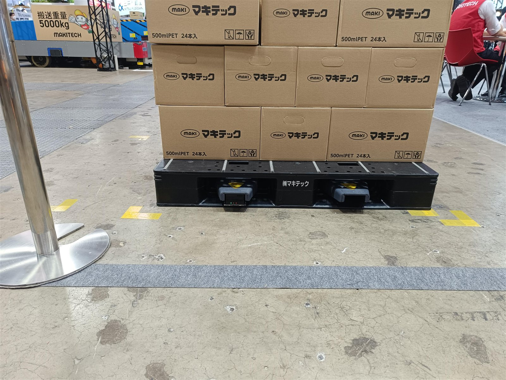
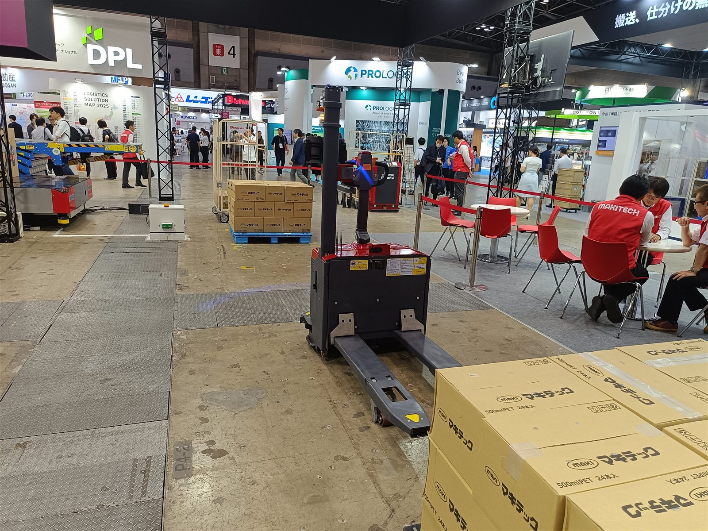

# マキテック

> 作成日：2026-07-27　最終更新日：2026-07-27

## 基本情報

| 項目 | 内容 |
|---|---|
| 企業名 | マキテック（MAKITECH） |
| 国 | 日本 |
| 展示会 | 国際物流総合展2025 第4回 INNOVATION EXPO（東京ビッグサイト） |
| 展示品 | ローリフト型AMR |

 

（左）パレットに載せた飲料ケース下に補助輪が出ている様子。（右）ブース全景。赤いベストの「MAKITECH」スタッフが対応（9/12 16:29）。

## 観察内容

- ローリフト型のAMRを出展
- パレットにフォークを差す前に補助輪が出てきて自重を支え、フォークホイールを収納する機構が付いている（をくだやの特許、と奥村は聞き取り）
- 補助輪を出し入れする機構が進歩性のポイントで、他社が類似技術で出願してこないかウォッチが必要との所感（奥村）

> 「補助輪を出し入れすることを進歩性として出願してこないかウォッチが必要です」（奥村）

## スギヤスへの示唆

- フォーク挿入前に補助輪で自重を支える発想は、自社のBX・DTRシリーズの安定性向上のヒントになり得る
- 特許動向のウォッチ対象として継続観察する

## 関連情報

- [国際物流総合展2025 第4回 INNOVATION EXPO Report.md](../../Reports/202509-InnovationEXPOinTOKYO/Report.md)

## 更新履歴

| 日付 | 内容 |
|---|---|
| 2026-07-27 | 国際物流総合展2025 第4回 INNOVATION EXPO（東京）から新規作成 |
