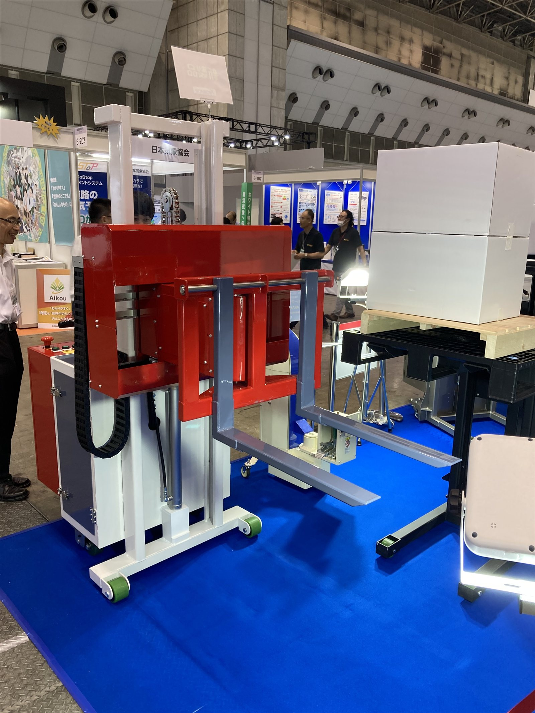
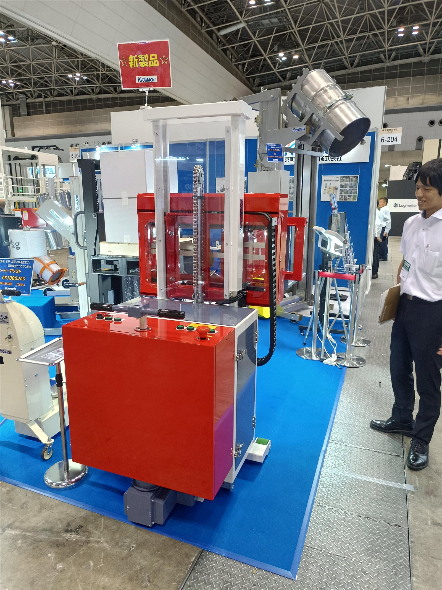
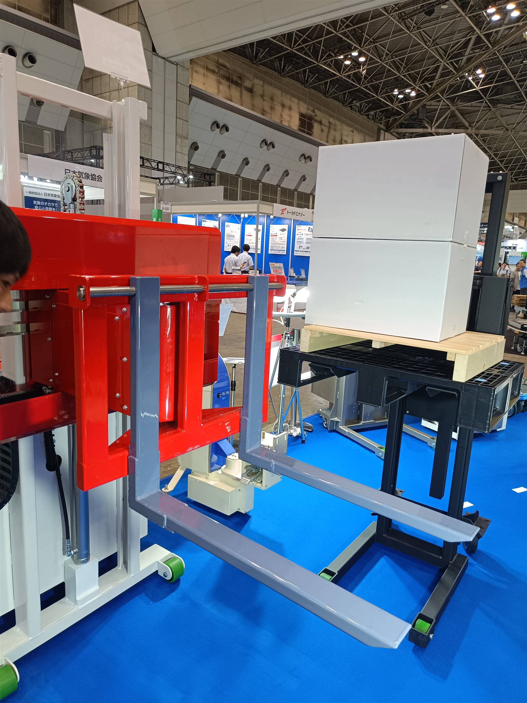

# 京町産業

> 作成日：2026-07-27　最終更新日：2026-07-27

## 基本情報

| 項目 | 内容 |
|---|---|
| 企業名 | 京町産業車輌株式会社（KYOMACHI） |
| 国 | 日本 |
| 展示会 | 国際物流総合展2025 第4回 INNOVATION EXPO（東京ビッグサイト） |
| 展示品 | ラックフォークタイプスタッカー、新製品「AS1000JAG オーバーアシスト」 |

 

（左）新製品「AS1000JAG オーバーアシスト」とラックフォークタイプのスタッカー。（右）「新製品」の札が付いたスタッカー全景（9/12 16:53-16:54）。

 

フォークが横向きに回転・横スライドするラックフォーク実演。奥にトーカドエナジーのブース看板が見える。

## 観察内容

- フォークが横向きに回転したり横スライドするラックフォークタイプのスタッカーを展示
- フォークリフトにしか見なかった機能だが、ウォーキー（手動歩行式）タイプにも搭載してきた
- 全体がかなり大きく、しかも前が見えないという課題があり、改善できればおもしろいとの所感（奥村）
- 新製品「AS1000JAG オーバーアシスト」を「新製品」の札とともに展示

> 「フォークリフトにしか見なかった機能ですがウォーキーにも付けてきました……全体がかなり大きくしかも前が見えない。これを改善できればおもしろい」（奥村）

## スギヤスへの示唆

- ウォーキータイプへのラックフォーク機構搭載は、自社BXシリーズの機能拡張の参考になり得る
- 前方視界の課題は、他社（京町産業）でも未解決という点で、自社が視界確保を訴求点にする余地がある（同展示会のSTCVの「視界の良さ」訴求と重ねて検討）

## 関連情報

- [国際物流総合展2025 第4回 INNOVATION EXPO Report.md](../../Reports/202509-InnovationEXPOinTOKYO/Report.md)

## 更新履歴

| 日付 | 内容 |
|---|---|
| 2026-07-27 | 国際物流総合展2025 第4回 INNOVATION EXPO（東京）から新規作成 |
