# 国際物流総合展2025 第4回 INNOVATION EXPO 出展レポート

> 作成日：2026-07-27　最終更新日：2026-07-27

## 📜 改訂履歴

| 日付 | 追記者 | 内容（クリックでジャンプ） |
|---|---|---|
| 2026-07-27 | ryo-m | 初版作成 |

---

## 出張概要

| 項目 | 内容 |
|---|---|
| 展示会名 | 国際物流総合展2025 第4回 INNOVATION EXPO |
| テーマ | 物流を止めない。社会を動かす。 |
| 会期 | 2025年9月10日（水）〜12日（金）10:00〜17:00 |
| 会場 | 東京ビッグサイト 東展示棟4〜8ホール（江東区有明3-11-1）|
| 出展規模 | 476社・団体／1876ブース（2025年9月1日現在） |
| 出展形態 | 自社ブース出展（ビシャモン、アテンド） |
| 出張者 | 前川、奥村 貴史、佐倉 遼 |
| 作成 | ryo-m（原資料：前川・奥村・佐倉の日報） |

出典：<a href="https://prtimes.jp/main/html/rd/p/000000188.000016501.html">一般社団法人日本能率協会 プレスリリース</a>（2025年掲載・2026年7月27日取得）

---

## 1. サマリー

自社ブース（ビシャモン）に3日間アテンド員として立ち、ABM・BDP・BX・DTR・電動車内製化（2t）の説明員を担当した。

- **ABM（AGV）が3日間を通じて圧倒的な人気。** 具体的な検討に入っている来場者が多く、タッチパネル操作を実際に触らせてほしいという声、スギヤスの自動化取り組み自体への驚きの声が相次いだ
- **電動車内製化（2t）には薄型・軽量ニーズが集中。** L50クラスの薄型要望、軽トラックへの車輪付きワーク積載相談、5トンクラスへの要望まで幅が広い
- **DTR（牽引台車）は複数台牽引・故障対応力を評価される場面が多かった。** 海外製の故障対応の悪さを引き合いに「ビシャモンなら」という後押しの声も
- **ASSで発表した段差解消トラバーサーへ、早速2件の改造引き合い**があり商談化
- BXの固定車輪・自在車輪の配置説明では理解を得づらい場面があり、接客面の課題も見えた
- 手隙の時間で他社ブースを見学し、LEAD TECH・ハクオウロボティクス・マキテック・ナブテスコ・京町産業・ナンシン・EnpowerJapan・ハンマーキャスター・燈株式会社の展示を確認した

---

## 2. 視察（出展）の目的

- 自社ブース（ビシャモン）のアテンド要員として、ABM・BDP・BX・DTR・電動車内製化（2t）の説明員を担当する
- 来場者の生の声（導入ニーズ・懸念・自社製品の認知度）を接客の中で直接収集する
- 手隙の時間に他社ブースを見学し、競合・周辺技術の動向を把握する

---

## 3. 背景（展示会概要）

「国際物流総合展2025 第4回 INNOVATION EXPO」は、日本産業機械工業会・日本産業車両協会・日本パレット協会・日本運搬車両機器協会・日本物流システム機器協会・日本ロジスティクスシステム協会・日本能率協会の共催による、物流機器・システムの総合展示会。テーマは「物流を止めない。社会を動かす。」で、476社・団体、1876ブースという規模で開催された。

出典：<a href="https://jma-news.com/archives/6623">一般社団法人日本能率協会 JMA ニュース</a>（2025年掲載・2026年7月27日取得）

---

## 4. 内容（時系列）

### 4.1 初日　9月10日（水）

 
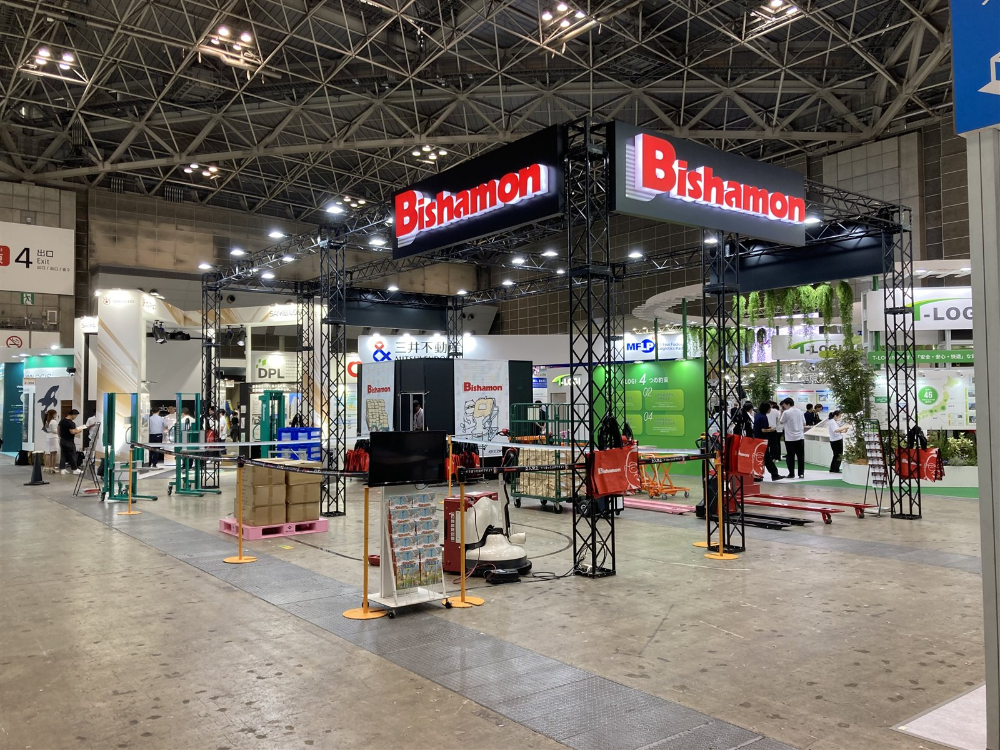

開場前のビシャモンブース。まだ人はまばらだが、BXシリーズ各機と赤いドライブハンドが整然と並ぶ（東京ビッグサイト東ホール、9:25）。

 

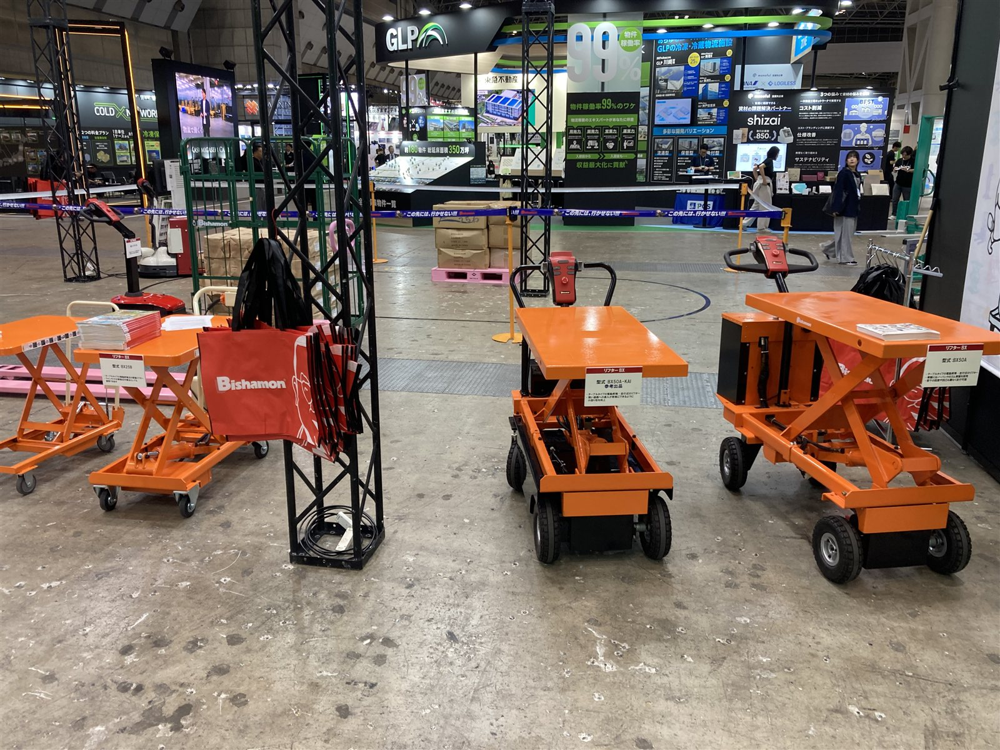
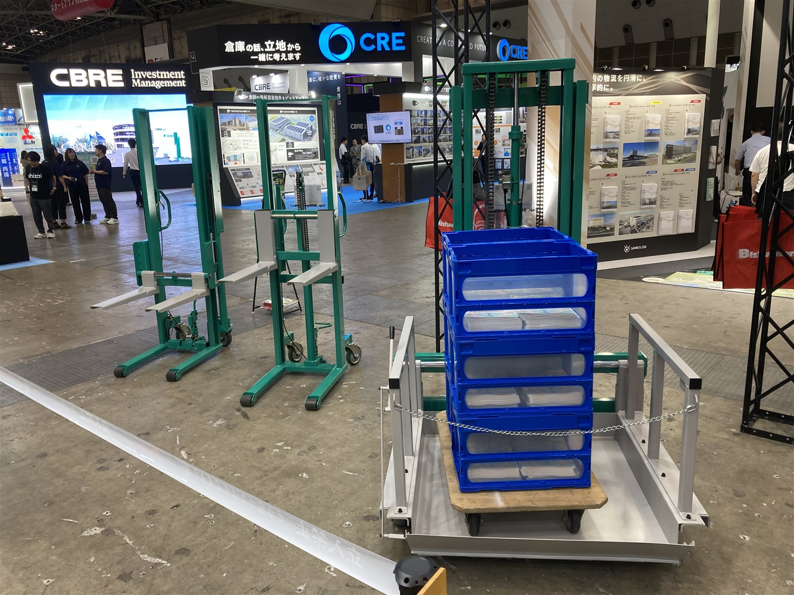

（左）リフターBX各型式（BX25B／BX50A-KAI／BX50A）。（右）トラバービュー STCV とトラバーリフト ST38。奥にCBRE・CREのブースが並ぶ。

 
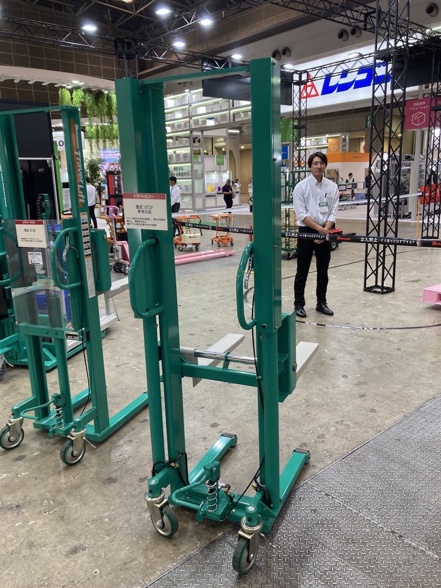

トラバービュー STCV を実際に手に取って操作感を確かめるスタッフ。開場前の最終確認。

事前想定とは違い、開場から15時頃までは盛況だったが、それ以降は失速する感じがあったという。客層は商社・倉庫業・運送業が多く、工場関係者は少なかった。興味を持たれた順はABM → BDP → BX15・DTR。

> 「対応がBDPだとできないのでこの点は優位性があるかと感じた」（前川）

内製電動車のヒアリングでは、パレット中心のワーク特性からか改造へのリアクションは少なめだったが、薄パレットへの対応の可否は明確な優位点として響いた。

ASSにも出展した段差解消のトラバーサーには、早速2件の改造引き合いがあり、その場で商談に発展した。

> 「折り畳んだカゴ車を10台重ねた状態での段差解消」「軽トラックへ車輪付きワークを積載したい」（前川）

いずれも改造対応が可能と判断し案を説明、代理店経由での見積もり対応となった。

初日の物流展参加者としては、佐倉もアテンド員として初日から加わっている。

> 「ビシャモンを知ってくださっているお客さんは多かったですがやはりハンドのイメージが強いらしく、ビシャモンは知っててもBXを知らないお客さんもいるくらいで驚きました」（佐倉）

DTRの体験では「これいいね」という好評の声とともに、連結牽引のニーズが多数あることを確認した。2t電動車は改造できることが評価され、開発コンセプトの手応えを得た一日となった。

---

### 4.2 2日目　9月11日（木）

開場前、手隙のスタッフでLEAD TECH・ハクオウロボティクスのブースを見て回った。

 
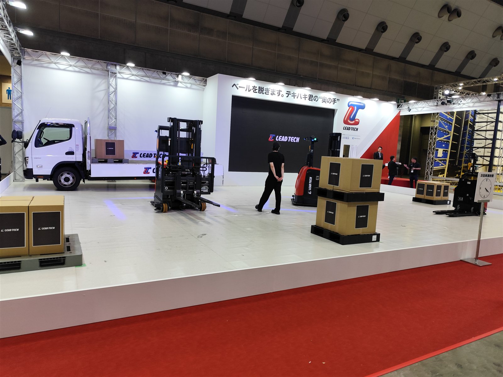

LEAD TECH ブース「テキハキ君の"奥の手"」。トラック・フォークリフト・パレット搬送のデモステージ（開場前、8:58）。

 
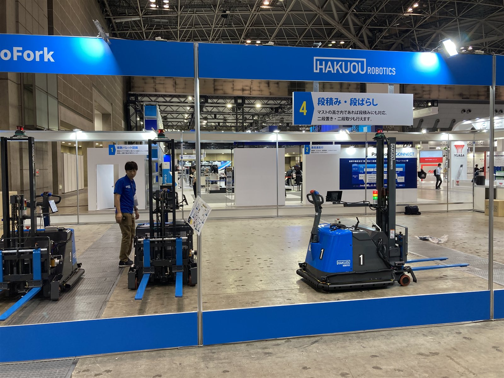

同ブースの全天候型無人牽引車「MyBull TMN-T60」（ブランド：LOGITO）。屋内外を問わず牽引搬送し、モニターには前方カメラ映像を表示していた。

 
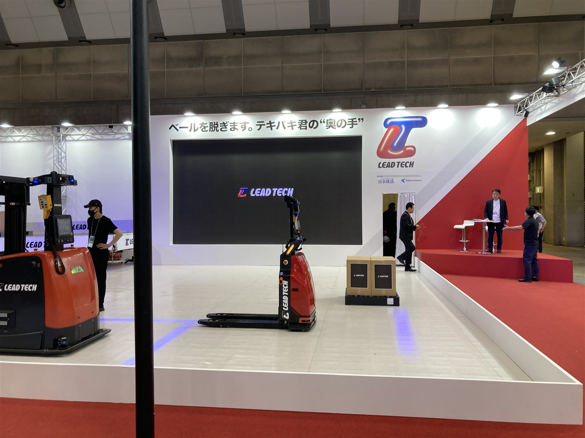

ハクオウロボティクス ブース。自動フォークリフト「AutoFork」を複数台展示。青いユニフォームのスタッフが操作を説明していた。

 
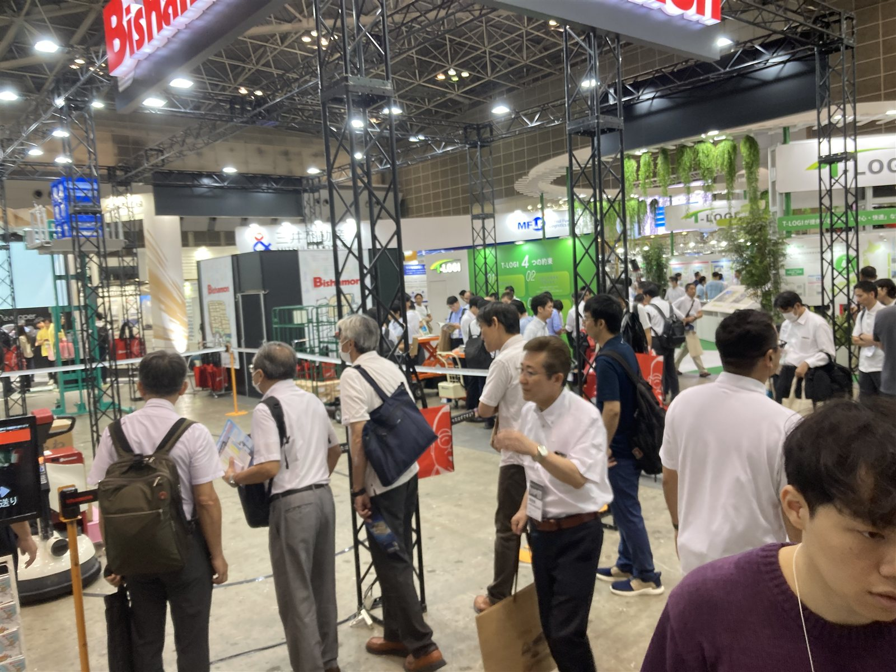

開場後、ビシャモンブースに人だかり。奥のT-LOGIブースまで来場者で埋まっている（11:18）。

 
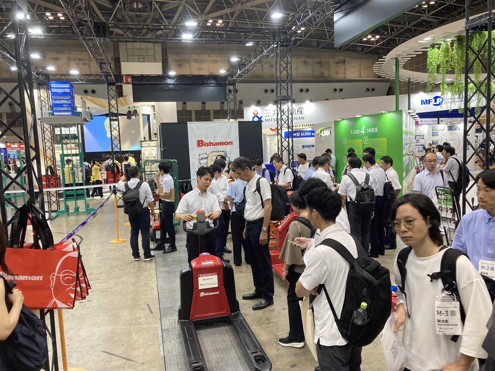

ビシャモンドライブハンド（型式BDP20LL）を囲んで説明を受ける来場者グループ。

2日目も朝から盛況で、前日以上の来場を感じたという。

> 「やはり1番人気はABM。具体的な話も出てきており、タッチパネルでの行き先操作など実際に触らせてほしいと言われることもあった」（前川）
> 「スギヤスさんも自動化始めたんだねと言われることも多々あった」（前川）

電動車内製は薄型への関心が特に強く、L50クラス（薄型）が欲しいという声、5トンクラスの設備運搬需要の声もあった。DTRへの関心も多く、2トンクラス専用台車の牽引ニーズが2件、海外製の故障・修理対応への不満から「ビシャモンさんで！」という後押しもあった。

ブースでは他社製品の売り込みも受けている。

> 「低始動キャスターの紹介あり。ダーコよりも軽いとのこと」（前川、ナンシンについて）
> 「次世代電池の研究、開発、製造のベンチャー。話を聞くと全個体電池がメインかなと」（前川、EnpowerJapanについて）

BDPやDTRでは免許の必要性を尋ねられる場面がたまにあり、来場者が気にするポイントであることがうかがえた。

 

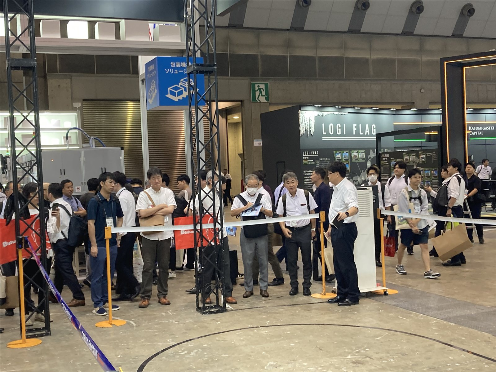
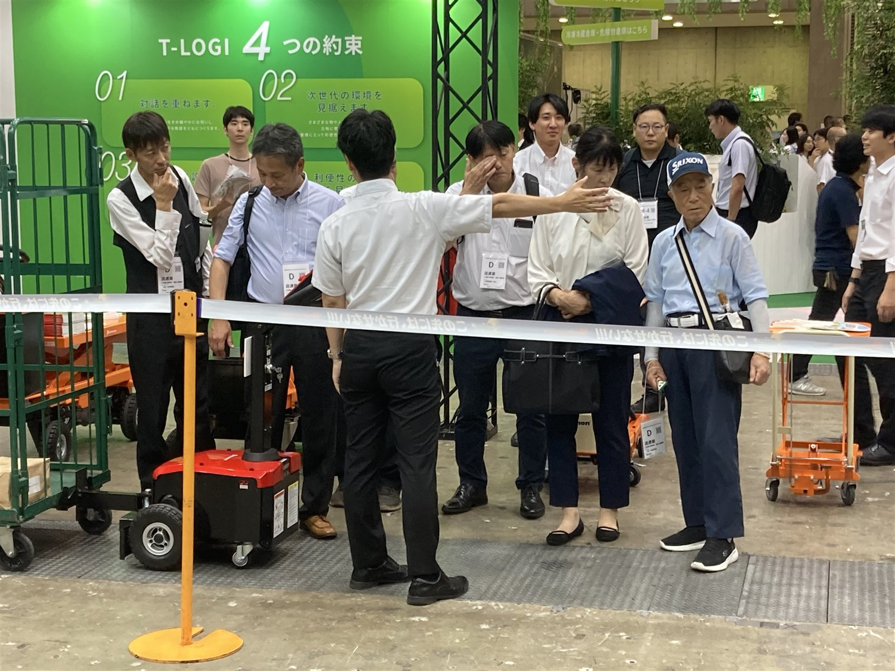

（左）午後、隣接するLOGI FLAGブース前まで人波が続く（14:58）。（右）ブース脇でスタッフが身振りを交えて説明する場面。年配の来場者グループも足を止めていた（15:02）。

この日から奥村もアテンドメンバーに加わった。

> 「まずは入口として何から始めればいいのか検討している」（奥村、AGV/AMR初心者の来場者について）
> 「これくらい（ABMくらい）から始めてみたいというニーズにもつながり、我が社にもチャンスが訪れていると感じています」（奥村）

使い方のニーズとしては、ループを描くレイアウトは確保できずUターン方式になる現場が多く、その場合パレットを1個しか置けないため「奥から詰めて3パレット程度は置けるようにしてほしい」という声を複数聞いたという。オートフォークダウンは好評で、複数パレットを置いてくる仕組みの検討価値が見えた。

> 「Bishamonさんがagvをやっているなんて初めて知ったという声も多く、まだまだPRできていないと感じています」（奥村）

佐倉は2日目、BX50Aを中心にアテンドした。

> 「その他商品に関しては初日と同様でABM、DTR、2t電動車はよくお客さんが入っててアテンドさせていただきました」（佐倉）

サカエの新入社員研修のため製品説明を頼まれる一幕もあり、人に教える難しさを実感したという。

---

### 4.3 最終日　9月12日（金）

 
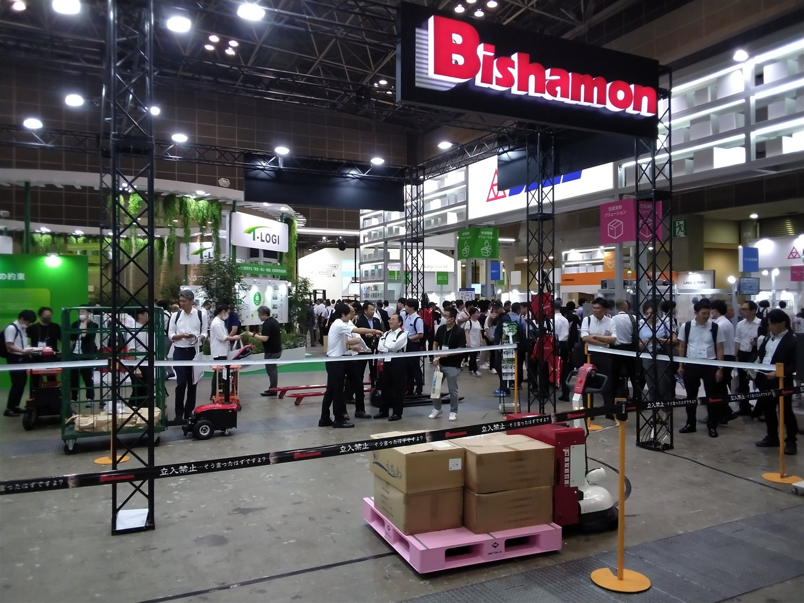

最終日、昼過ぎのブース前。立入禁止テープの向こうで来場者と商談が続く（12:37）。

最終日は金曜ということもあり、一日中客足が途切れず大盛況だった。

> 「相変わらずABMは人気高く、そしてABMのコンセプトは納得してもらえてます」（前川）
> 「新カタログの比較表がわかりやすく好評でこれだけを写真撮っていかれる人も」（前川）

電動車内製はフォーク長さ改造により、プラットホームでトラックからパレットを出す際に2パレットを同時に運べるという具体的な話も出た。カゴ車の複数台運搬の相談は3日間で複数回聞かれ、現状はフォークリフトやハンド（嵩上げ）でカゴ車フレームを持ち上げて運んでいるという実態も分かった。

> 「電動車内製化のひとつの仕様として提案ができないか考えてみたい」（前川）

STCV（視界確保タイプ）、BXA-KAI（低床タイプ）についても、それぞれ具体的な改善提案につながる声を得た。

夕方、手隙の時間で他社ブースを見学した。

 

（左）マキテック ローリフト型AMR。パレットに載せた飲料ケースの下に補助輪が見える。（右）同ブース全景。赤いベストの「MAKITECH」スタッフが対応していた。

 

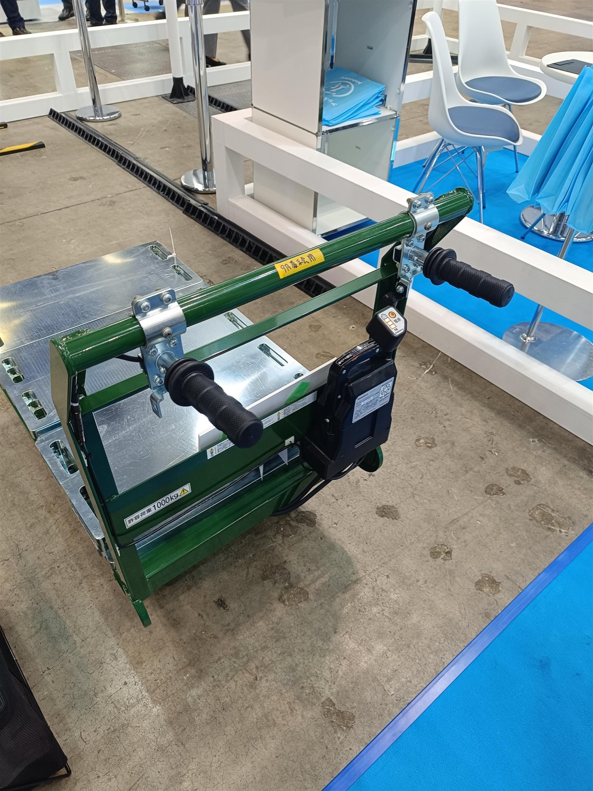
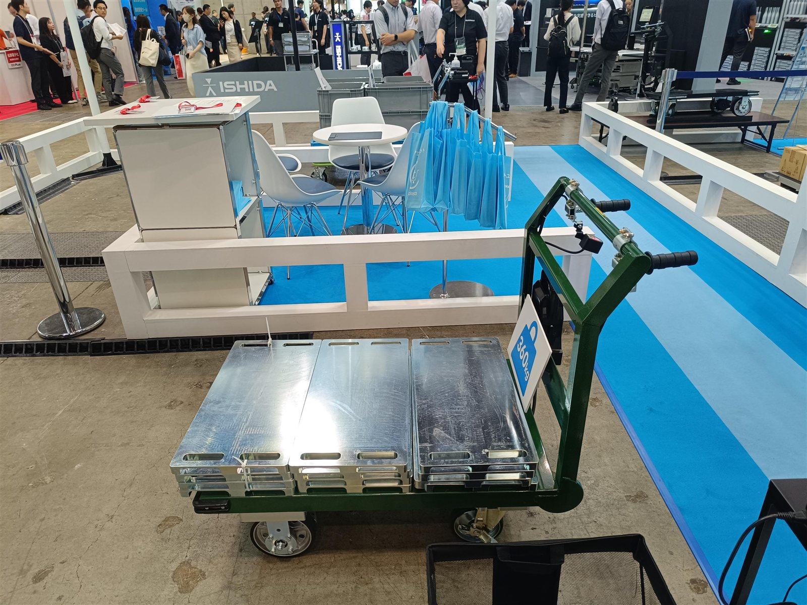

（左）許容荷重1000kgの電動アシスト台車の実演機。ハンドル部にバッテリー残量表示があった。（右）同系統の360kg表示の台車。同じ緑色の車体・グリップ形状で、複数の荷重クラスを揃えている様子がうかがえる。

 

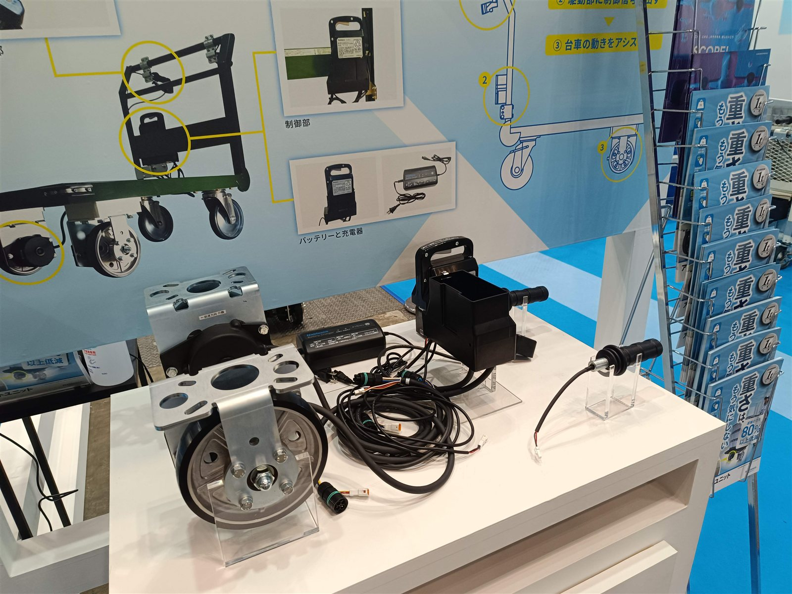
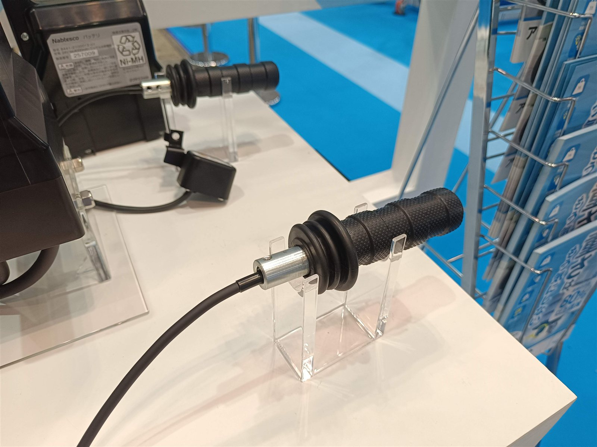

（左）ナブテスコ ブースのアシストユニット分解展示。駆動輪・バッテリー（Ni-MH）・充電器・操作グリップが並ぶ。（右）操作グリップのクローズアップ。握り部分のストロークで検知する方式に見える。

 

（左）京町産業ブース、新製品「AS1000JAG オーバーアシスト」（左）とラックフォークタイプのスタッカー（右奥）。（右）「新製品」の札が付いたラックフォーク式スタッカーの全体像。

 

同ブース、フォークが横向きに回転・スライドするラックフォークタイプスタッカーの実演。奥にトーカドエナジーのブース看板が見える。

 
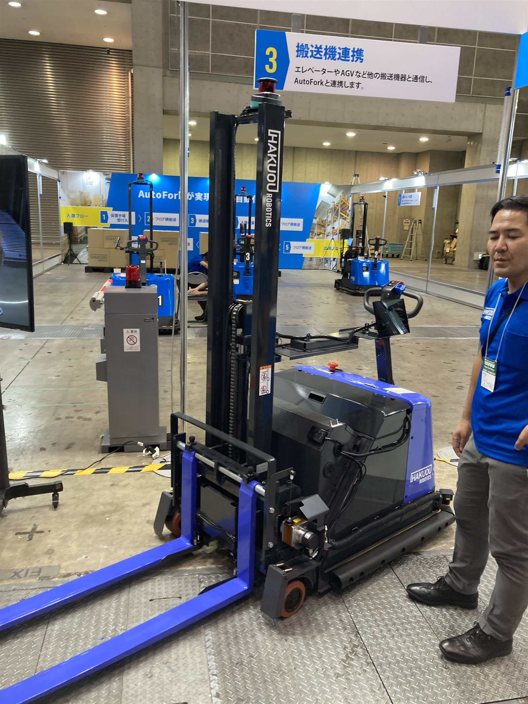

ハクオウロボティクス ブース、AutoForkの「搬送機連携」パネル。エレベーターやAGVなど他の搬送機器と通信し連携する機能を訴求していた。

奥村は最終日、ABM15の説明員を続けながら、夕方30分ほど他社ブースを見学している。

> 「具体的な検討を始めておられる方が多く足を運んでくださいました……コンセプトを説明すると『場所によってはこれで十分だね』とABMを選択肢の一つに加えていただける感触を持ちました」（奥村）
> 「マキテック　ローリフト型のAMRを出展。パレットにフォークを差す前に補助輪が出てきて自重を支え、フォークホイールを収納する機構（をくだやの特許）が付いていました」（奥村）
> 「ナブテスコ　2輪駆動のアシストユニットを出展　触ってみましたが加減速に違和感はなくスムーズでした。センシング部分は歪みではなく握り部分のストロークで検知しているようでしたので真似して試作してみたいです（ニデックのユニットを活用）」（奥村）
> 「ハクオウロボティクス　ZMPをスピンアウトした方が創業した自動フォークリフトのエンジニアリング企業……昨年2.5km/hだったものが今年4km/h を超えるようになり実用的な速度になっています」（奥村）

トーカドエナジーについても、リチウムイオンバッテリーと充電器を出展しており、セルはパナソニックの筒型電池、カートリッジ式のパッケージで購入できる点が確認されている（前川日報より）。

佐倉は最終日、BXの固定車輪・自在車輪の配置について質問に苦戦する場面があったという。

> 「なかなか理解していただけない方で対応に困る事がありました……このような方の対応の仕方を勉強していきたいと思いました」（佐倉）
> 「3日間を通じてBX50A改のヒアリングはグランドフェアに比べ全然聞けませんでした……せっかく参加させていただいたのに不甲斐ないです」（佐倉）

ラスト30分の他社ブース見学では、ハンマーキャスターの車輪（凸凹道でも安定して走行できる緩衝機構付き）が印象に残ったという。

> 「オプションでBXにつけれる対応をすればお客さんのニーズに答えれる商品になるのではないかなと思いました」（佐倉）

---

## 5. まとめ

### 視察全体を通じた気づき・所感

3日間を通じ、ABMがブースの圧倒的な人気商品であり続けたことが最大の収穫だった。展示会でのABM認知の広がりにより、今後の販路拡大の兆しを感じた一方、「ビシャモンさんがAGVをやっているなんて初めて知った」「ビシャモン＝ハンド」という声が繰り返し出ており、AGV/AMR領域のPR不足という課題も同時に浮き彫りになった。

電動車内製化（2t）は薄型・軽量・5トンクラスまで、ニーズの幅広さが確認できた一方、DTRの連結牽引ニーズ、カゴ車複数台運搬という具体的な現場課題も複数件聞き取れており、開発の方向性を裏付ける材料になった。

BXの固定車輪・自在車輪の説明で来場者の理解を得づらい場面があったことは、接客・説明資料の改善余地として持ち帰りたい。

> 「自分からの印象はやはり目を見て話してくれる人のほうが印象深かった。こんなの当たり前のことですが、この当たり前のことを再意識していきたいと感じた」（前川）

### 今後の展開・アクション

- ASS由来の段差解消トラバーサー改造2件について、代理店経由での見積もり対応を進める
- 薄型電動車（L50クラス）・5トンクラス電動車の需要を踏まえた商品ラインアップの検討
- DTRの複数台連結牽引の開発を継続する
- カゴ車の複数台運搬・ABMの奥詰め3パレット化など、AGV/AMRの積載仕様拡張を検討する
- BXの固定車輪・自在車輪配置について、来場者に伝わりやすい説明資料・トークスクリプトを整備する
- ビシャモン＝ハンドという認知を払拭し、AGV/AMR領域のPRを強化する
- ナンシンの低始動キャスターと自社使用中のイノアック製キャスターとの比較検討（サンプル取り寄せ予定）
- ［要確認：燈株式会社のAI活用アプリケーションの詳細な後日説明の結果］

---

## その他の写真

本編の流れには収めなかった写真を収録する。

 

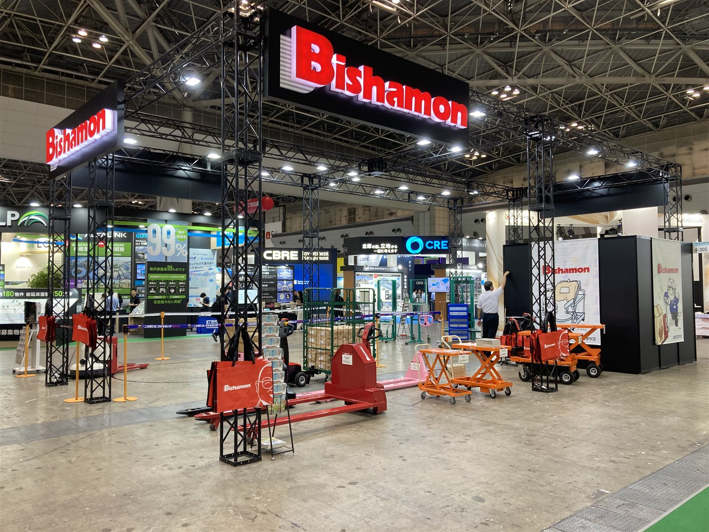
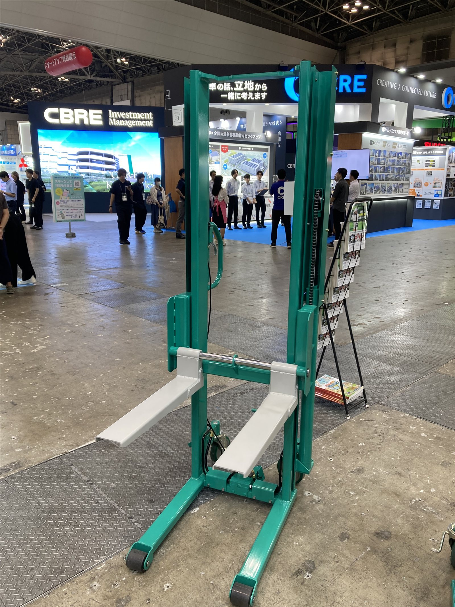

 

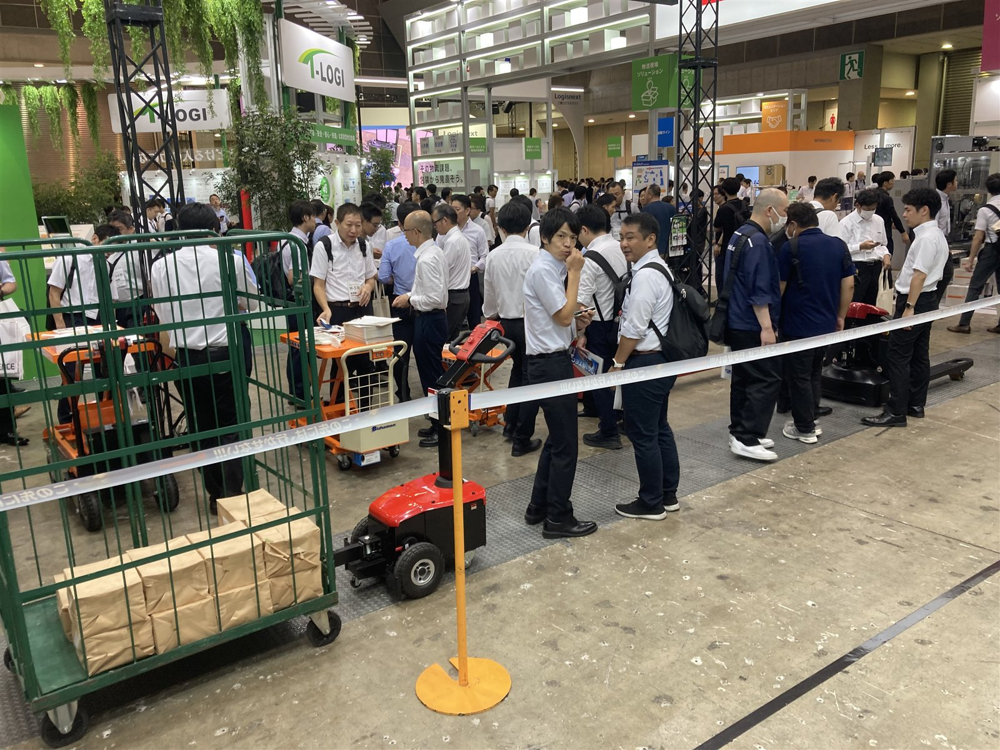
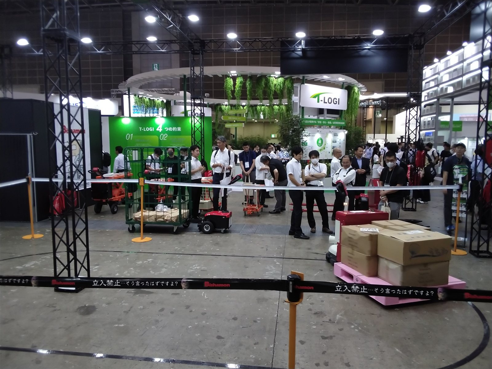

 

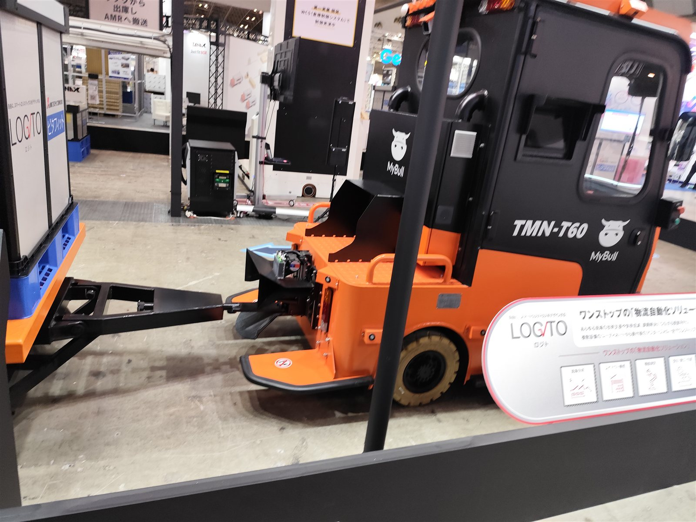
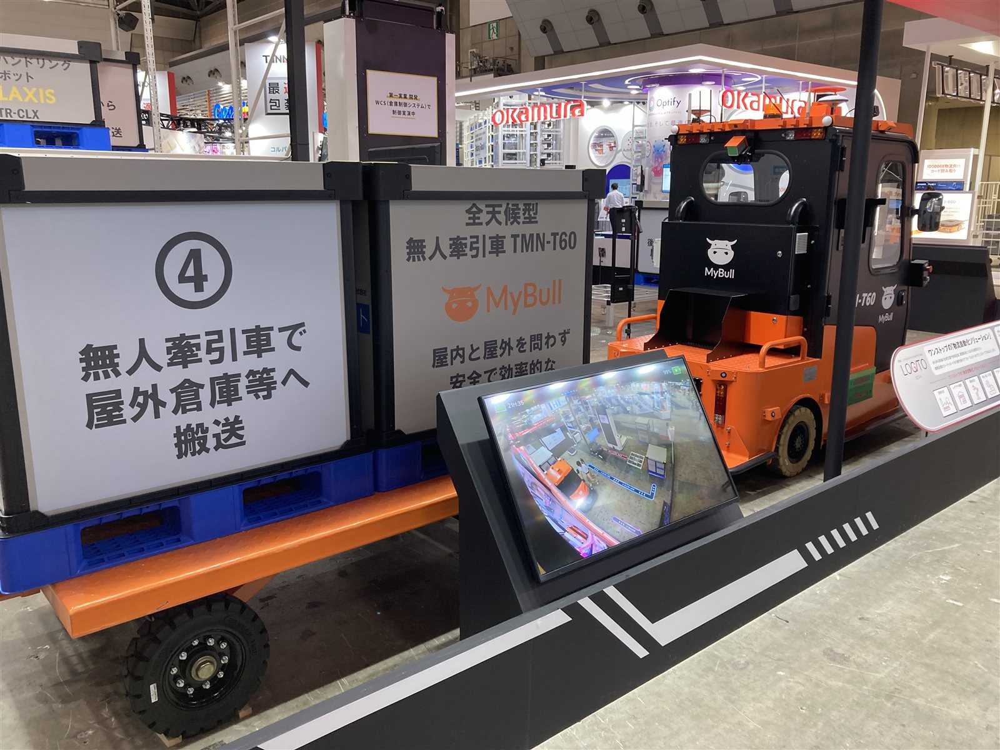

 

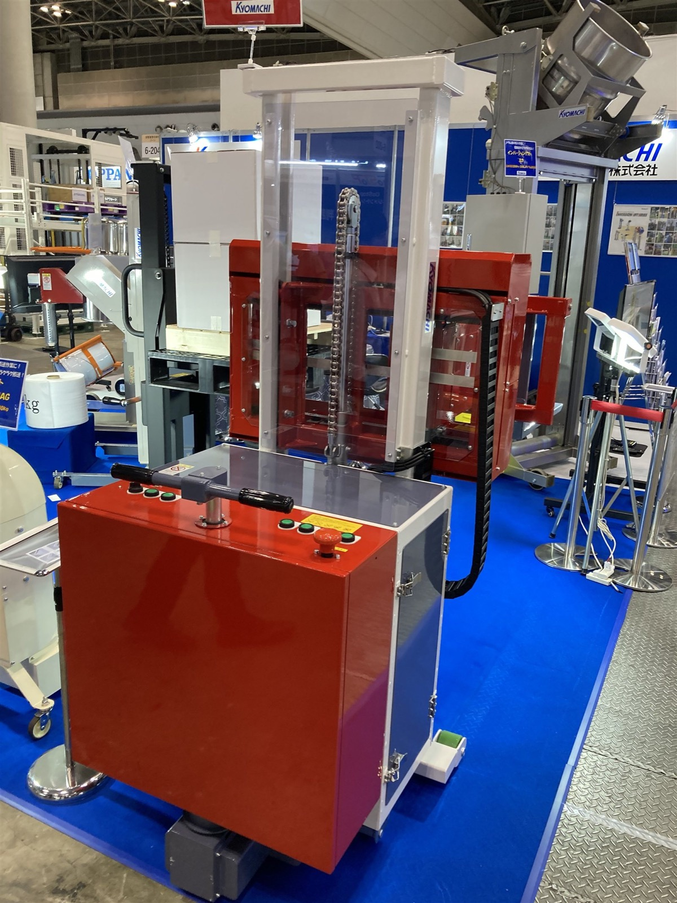
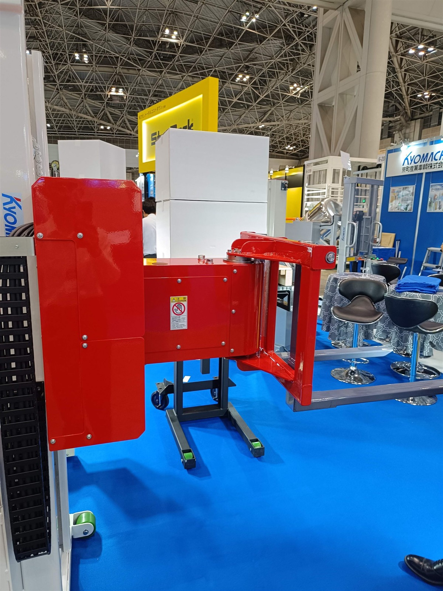

 
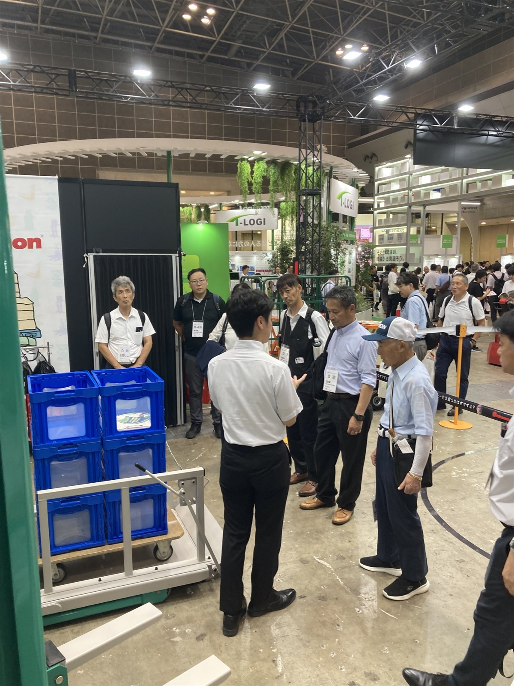
