# 課長研修（中産連 第120回）レポート

> 2026年7月22日・23日に受講した課長研修について、講義資料写真とアンケートを元に、講師の説明内容のメモを元とする。

## 研修概要

- 研修名：第120回 課長研修
- 主催：一般社団法人 中部産業連盟（中産連）
- 日程：2026年7月22日（水）・23日（木）
- 今回の受講範囲：課長の役割理解、戦略リーダー編、アンケートによる現状把握
- 本稿の方針：**写真は全点掲載**し、スライドに残っていない講師の説明や、その場で得た意味づけを文章で補う

## 全体所感

今回の研修を通して自分が最も強く感じたのは、課長としての課題を「部下が育たない」「プレイヤー業務から抜けられない」と見ていたが、その根っこには自分自身の言語化不足、伝達不足、育成の力不足があるのではないか、ということである。グループワークでも新米課長が多く、似たような悩みを持つ人が多かったが、話を聞くほど、部下が分かっていないのではなく、上司側が十分に言葉にできていない、確認できていない場面が多いのだと感じた。自分自身も、普段の会話量や経験の共有で十分伝わっているつもりになり、相手の理解確認を曖昧にしてきた面があると振り返っている。

また、管理と実務の比率についても、単に実務量の多寡の問題として捉えるのではなく、任せるための準備や、認識を揃えるための働きかけが不十分なままでは、管理者自身が仕事を抱え込みやすい構造になるのだと感じた。人材育成も、相手側の問題として見るだけでは不十分で、上司がどれだけ意図を言葉にし、期待水準を合わせ、理解のずれを埋められるかという関わり方の質に大きく左右される。今後は、業務を進めること自体以上に、伝わる形で共有し、認識を合わせながら任せていくことを、自分の基礎課題として捉え直したい。

戦略フレームや方針管理の考え方も多く学んだが、自分にとって大きかったのは、フレームそのものの理解よりも、それを使って本質を捉え、相手に説明できる状態まで持っていく必要があると腹落ちしたことである。異なる会社の受講者との対話では、自社では見えにくい論点や、自分の考えの浅さ、まとめて伝える力の差も見えた。次回以降の部下育成中心の研修に向けても、まずは「人が育たない」と外に課題を置くのではなく、自分の育成力・伝達力・言語化力を鍛えることが先だという気づきを、今回の一番大きな持ち帰りにしたい。

## 写真一覧

- 01. 研修全体の流れ（講義資料）
- 02. リーダーシップの歴史 / 状況適応型リーダーシップ（講義資料）
- 03. 問題解決のステップを指導する（講義資料）
- 04. SWOT分析（講義資料）
- 05. プロダクト・ライフサイクル（講義資料）
- 06. 経験重視と言われる理由（講義資料）
- 07. 中長期のビジョンを描く（講義資料）
- 08. 戦略策定の手順（講義資料）
- 09. ポーターの競争戦略から（講義資料）
- 10. 戦略のもう一つの見方 RBV（講義資料）
- 11. ブルーオーシャン戦略（講義資料）
- 12. 新事業の創出に向けて（講義資料）
- 13. アンゾフのマトリクス / 事業分野の検討（講義資料）
- 14. QC / 方針管理の起源（講義資料）
- 15. 方針管理の基本サイクル（講義資料）
- 16. 方針が連鎖している（講義資料）
- 17. 方針設定の進め方（講義資料）
- 18. まとめる際にはストーリー化を（講義資料）
- 19. 点検はプロセスまで（講義資料）
- 20. 方針管理が伝統的に得意とされること（講義資料）
- 21. PPM（ポートフォリオマネジメント）（講義資料）
- 22. リバース・イノベーション（講義資料）
- 23. 受講者属性 / 現状の管理業務比率（アンケート）
- 24. 理想の管理業務比率 / 増やしたい管理業務（アンケート）
- 25. 実務をどう減らすか / 部門の業務課題（アンケート）
- 26. 人材課題 / 課長職の魅力（アンケート）
- 27. 魅力の判断要素 / 負担感の大きさ（アンケート）
- 28. 負担の大きさを判断する要素（アンケート）

## 1. 課長の役割・問題解決・リーダーシップ

### 01. 研修全体の流れ

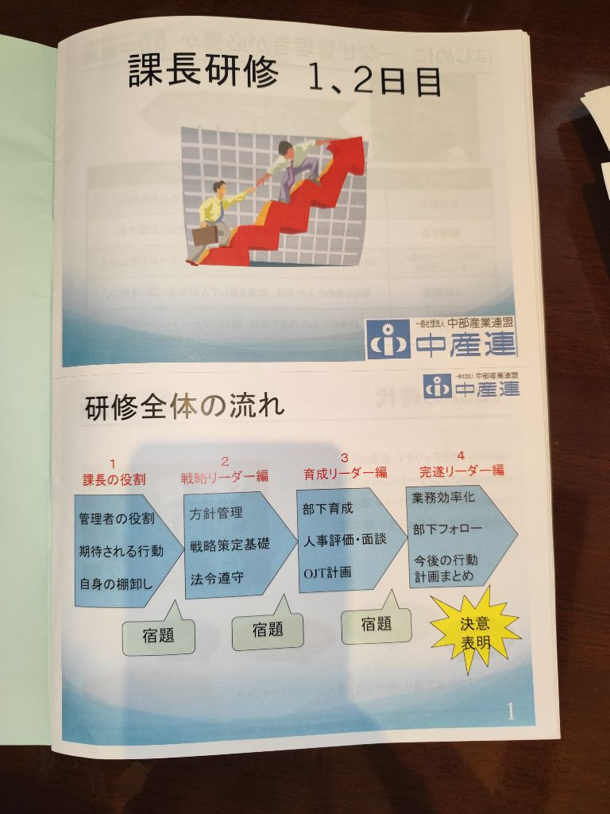

このスライドは全4回の研修設計図であり、今回が単発講義ではなく「課長としての役割理解→戦略→育成→完遂」へと段階的に深まるプログラムであることを示している。今回受講したのは主に第1・第2領域で、課長としての立ち位置を再確認したうえで、戦略フレームを実務へ接続する準備回だったと整理できる。したがって本レポートでは、このスライドを起点に「今回の学びは、後続の人材育成・行動計画へつながる前半戦である」と位置づける。

### 02. リーダーシップの歴史 / 状況適応型リーダーシップ

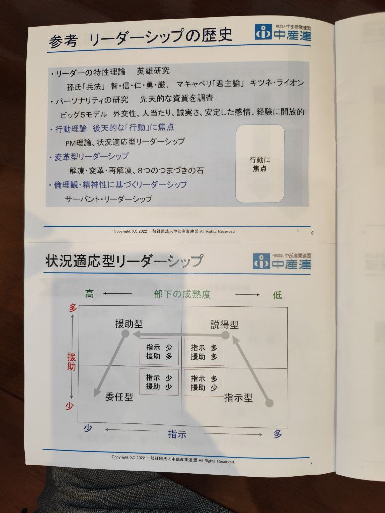

リーダーシップは、生まれ持った資質だけで決まるという見方から、行動・変革・倫理観へと重点が移ってきたことが示されている。特に状況適応型リーダーシップの図は、部下の成熟度によって「指示」と「援助」の配分を変える必要があることを明快に示しており、課長の関わり方を固定化しない重要性を教えている。現場では、できない部下に任せられないのではなく、任せ方と支え方を相手ごとに変えることが管理職の仕事であると受け止めた。

### 03. 問題解決のステップを指導する

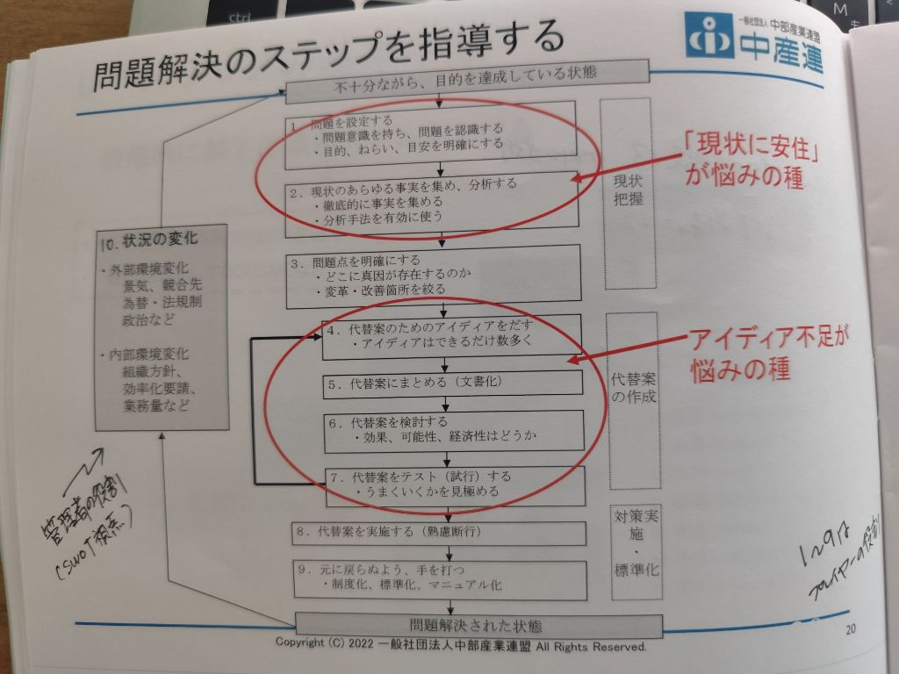

このスライドは、問題設定から事実収集、真因把握、代替案検討、試行、標準化までを一連の流れとして示している。重要なのは、これは単なる個人の問題解決手順ではなく、課長が部下へ問題解決を教える際の「指導の型」でもあるという点である。研修音声の文脈を踏まえると、管理者は答えを先に与える人ではなく、問題の見方・進め方・振り返り方を整える人であり、その意味でこのスライドは育成リーダーとしての基本姿勢にもつながっている。

## 2. 戦略フレームワークと事業の見方

### 04. SWOT分析

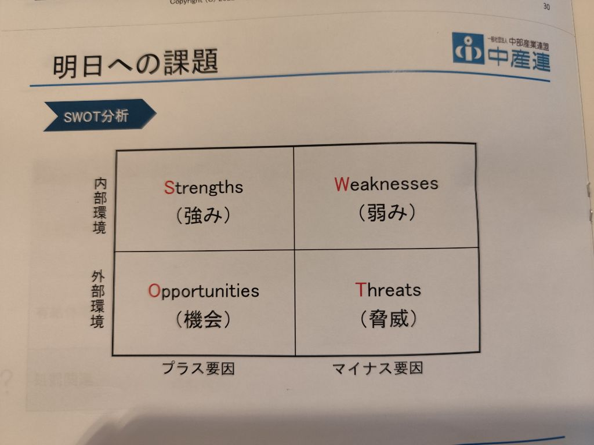

SWOTは単なる4象限の記入作業ではなく、内部要因と外部要因を切り分けたうえで、どこに戦略課題があるかを見抜くための起点である。研修音声の整理でも、フレームは答えではなく「思考の踏み台」にすぎないという趣旨が強調されており、このスライドも同じ意味を持つ。自部署に引きつけるなら、強みや弱みを列挙して終わるのではなく、「外部変化に対して何を伸ばし、何を補強するか」まで落とし込んで初めて使える道具になる。

### 05. プロダクト・ライフサイクル

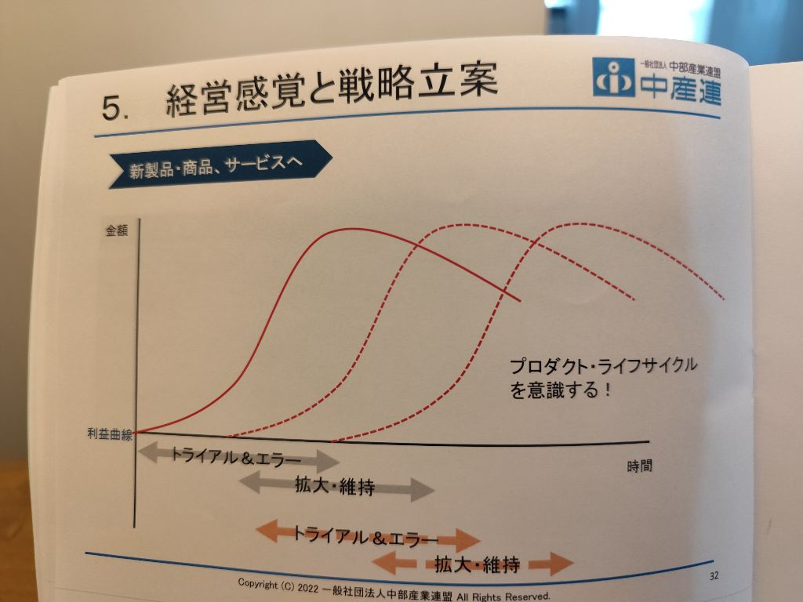

製品やサービスは、導入・拡大・維持の各段階で必要な打ち手が変わるため、同じ管理の仕方を続けてはいけないことを示すスライドである。研修音声では、成熟商品と生まれたての商品ではマネジャーの打ち手が全く違うという含意があり、時間軸を持つことで人員配置や投資判断の説明が変わることが示唆されていた。開発テーマを並列に扱うのではなく、「いまどの段階にあるか」で支援の仕方を変える視点が重要だと感じた。

### 06. 経験重視と言われる理由

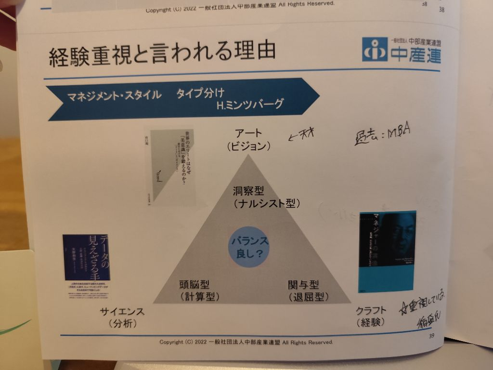

マネジメントには、分析だけでも、勘だけでも足りず、ビジョン・サイエンス・クラフトの三つをどうバランスさせるかが必要だという文脈で理解できるスライドである。現場経験は管理職の大きな強みだが、それを再現性ある判断に変えるには、経験を言語化し、構造化して、人に説明できる形へ変える必要がある。自分自身もクラフト寄りの強みがある一方で、分析と言語化を意識的に伸ばさないと、管理職としての幅が狭くなると感じた。

### 07. 中長期のビジョンを描く

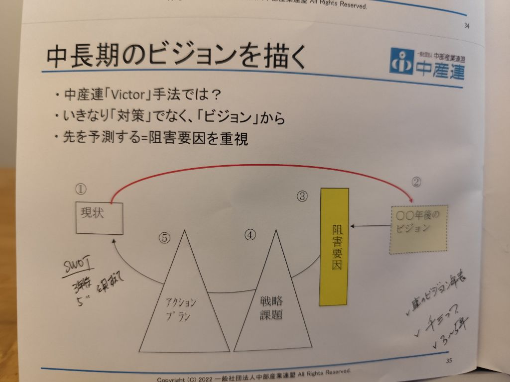

このスライドは、「現状→対策」へ直行するのではなく、「現状→将来像→阻害要因→戦略課題→アクション」という順で考えるべきことを示している。文字起こしの示唆を重ねると、これは単なる計画論ではなく、バックキャスト的に将来から現在を見直すための枠組みとして読むべきである。開発テーマでも、いま何を直すかより先に、3〜5年後にどうありたいかを置くことで、目先の改善と本質課題を切り分けやすくなる。

### 08. 戦略策定の手順

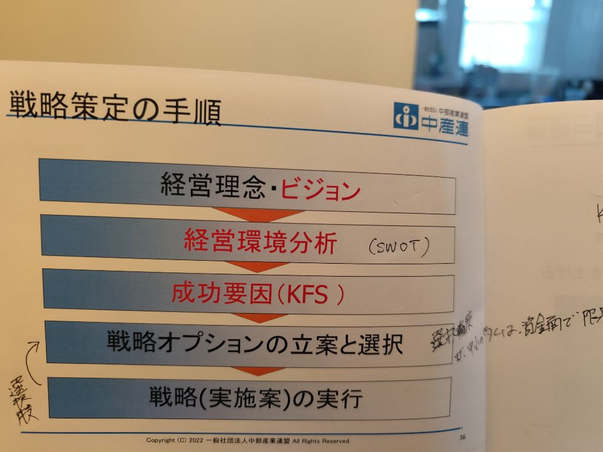

経営理念・ビジョンから環境分析、成功要因、選択肢の比較、実行へと至る基本の流れを示している。研修音声では、KFSやターゲット設定、複数の選択肢を持つことの重要性が補足されており、特に中小企業では資源制約の中で「どの選択肢に絞るか」を決めること自体が戦略だと理解できる。フレームを埋めることが目的ではなく、なぜその選択になるのかを自分の言葉で説明できることが、課長にとっての実践レベルだと感じた。

### 09. ポーターの競争戦略から

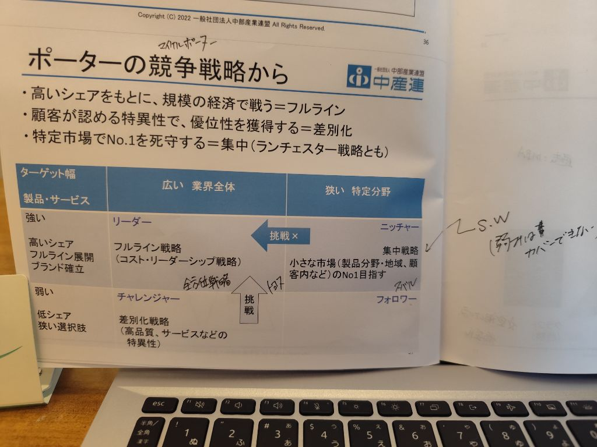

高シェアで戦うのか、差別化するのか、特定市場に集中するのかを整理する競争戦略の基本スライドである。研修音声では、リフト業界のような成熟市場でも、ニッチ領域や特殊案件のように手腕を発揮しやすい場所を見極めることが重要だという読み替えがされていた。つまりこの図は教科書知識ではなく、「自部署はどこで勝つか」「どこに絞るか」を決めるための現場用地図として使うべきだと理解した。

### 10. 戦略のもう一つの見方 RBV

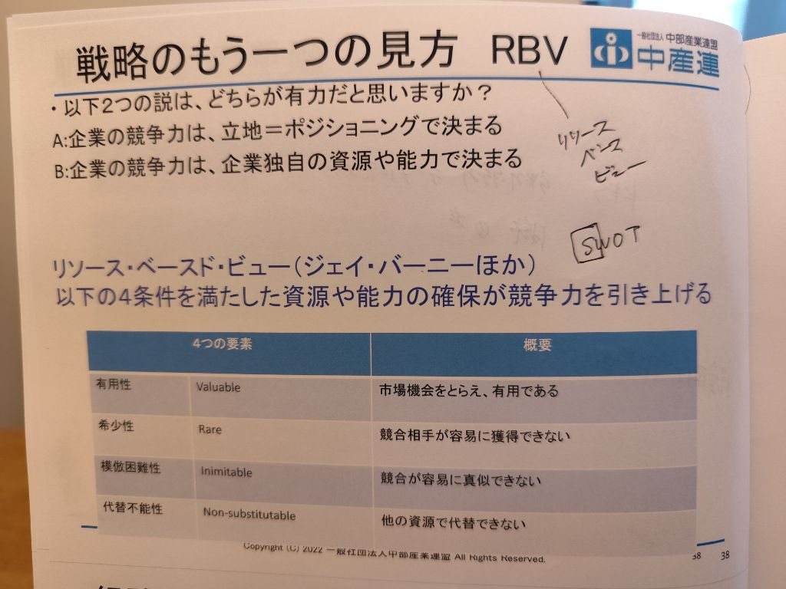

RBVは、競争力を市場ポジションだけでなく、自社固有の資源や能力から見る視点である。文字起こしでは、据付工事の現場知のような模倣困難な暗黙知こそが Valuable / Inimitable に寄る資源として扱える、という読み替えが示されていた。開発グループとしても、技術そのものだけでなく、現場の知見、社内連携力、顧客理解のような見えにくい資産を「削ってはいけない強み」として認識する必要がある。

### 11. ブルーオーシャン戦略

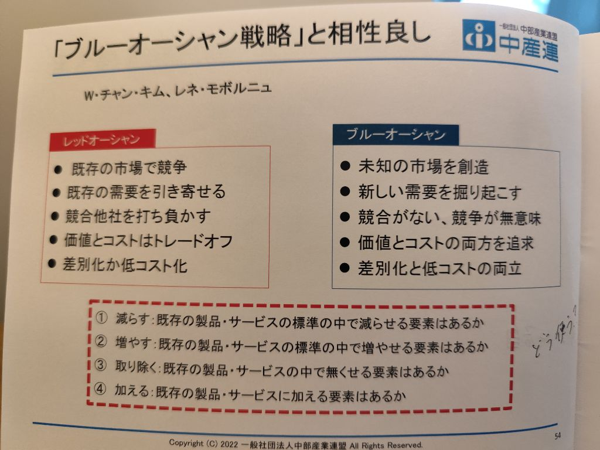

既存市場での競争を前提にするのでなく、価値とコストの見直しによって競争のない余地をつくる発想を示すスライドである。研修音声では、特に Reduce / Eliminate の発想、すなわち足し算ではなく「当たり前に付いているものを疑う」ことの重要性が強調されていた。新事業だけの話ではなく、設計標準、過剰仕様、業務の手間にもそのまま当てはまり、現場改善に使える考え方だと感じた。

### 12. 新事業の創出に向けて

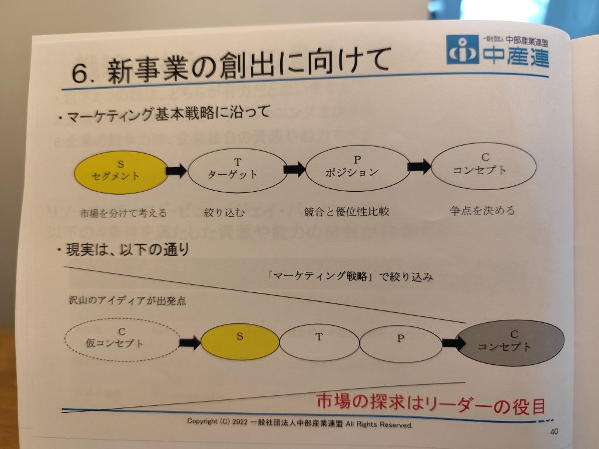

STPからコンセプトへ至る王道の流れを示しつつ、実務では大量のアイデアを出発点にしながら徐々に絞り込む現実も示している。講師説明の文脈では、市場を探索すること自体がリーダーの仕事であり、忙しいことを理由に市場探索を止めると新しい打ち手が生まれなくなるという含みがある。課長としては、日常実務に埋もれず「誰に何を届けるのか」を考える時間を意識的に確保する必要がある。

### 13. アンゾフのマトリクス / 事業分野の検討

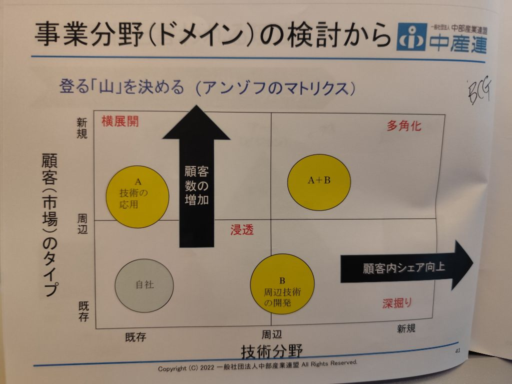

既存／新規の市場と技術の組み合わせで、どの方向へ進むのかを整理するスライドである。文字起こしでは、実務上はフレームを全部持ち出すのでなく、SWOTで診断し、PPMで配分し、アンゾフで方向づける程度で十分だという示唆があり、このスライドはまさに「どの山に登るか」を決める道具として位置づけられる。深掘り、横展開、多角化を混同せず、自部署のテーマ群を整理する際の土台になる。

## 3. 方針管理と展開・レビュー

### 14. QC / 方針管理の起源

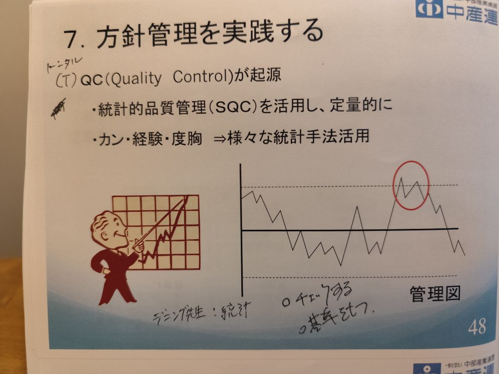

QCの原点は「チェックする」「基準を持つ」という、ごく基本的だが実務では見失われやすい考え方にある。手書きメモに残っていたデミング、管理図、基準という言葉も、このスライドに収束して理解できる。課長の仕事は感覚で評価することではなく、見方の基準を共有し、現場が同じ物差しで判断できる状態をつくることだと再認識した。

### 15. 方針管理の基本サイクル

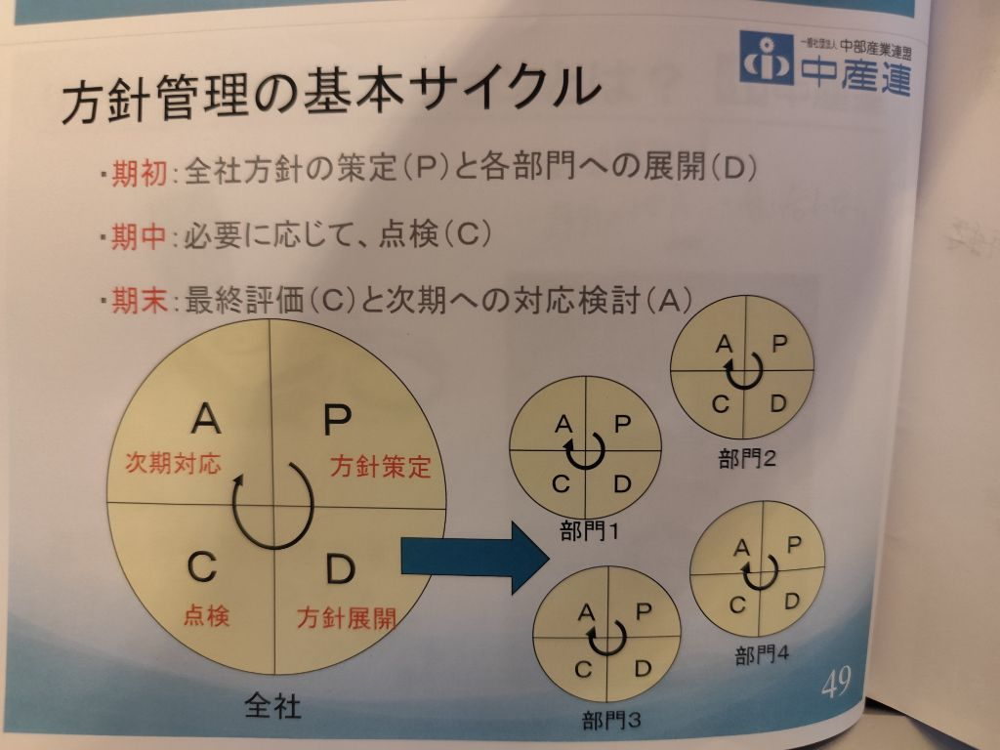

期初・期中・期末でPDCAを回す方針管理の骨格を示したスライドである。研修音声やメモでは、レビューは数字だけを追うのでなく、プロセスまで見て修正するものであることが強調されていた。したがってこのサイクルは単なる進捗確認表ではなく、「何ができていて、なぜ進まないのか」を見て、次の行動に翻訳するための管理の型と理解すべきである。

### 16. 方針が連鎖している

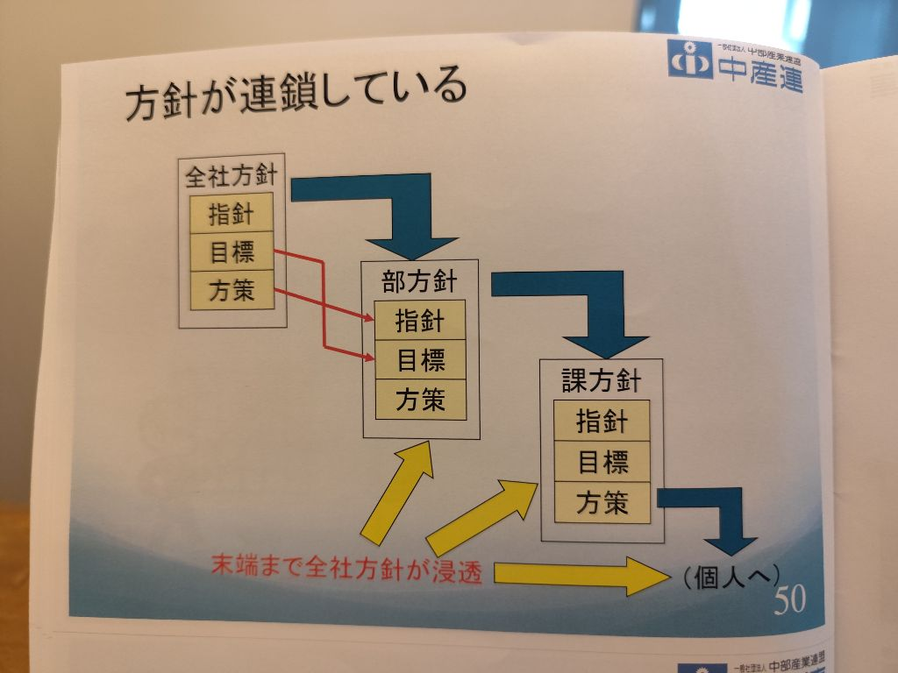

全社方針が部、課、個人へと階層的に落ちていく構造を示すスライドである。メモの「方針の連鎖」「指示を理解」「必要人材像」は、このスライドと合わせることで意味が明確になり、方針は文書ではなく人の行動に翻訳されて初めて機能することが分かる。課長の役割は、自分の理解で止めず、メンバーが自分の仕事として言い換えられるところまで接続することである。

### 17. 方針設定の進め方

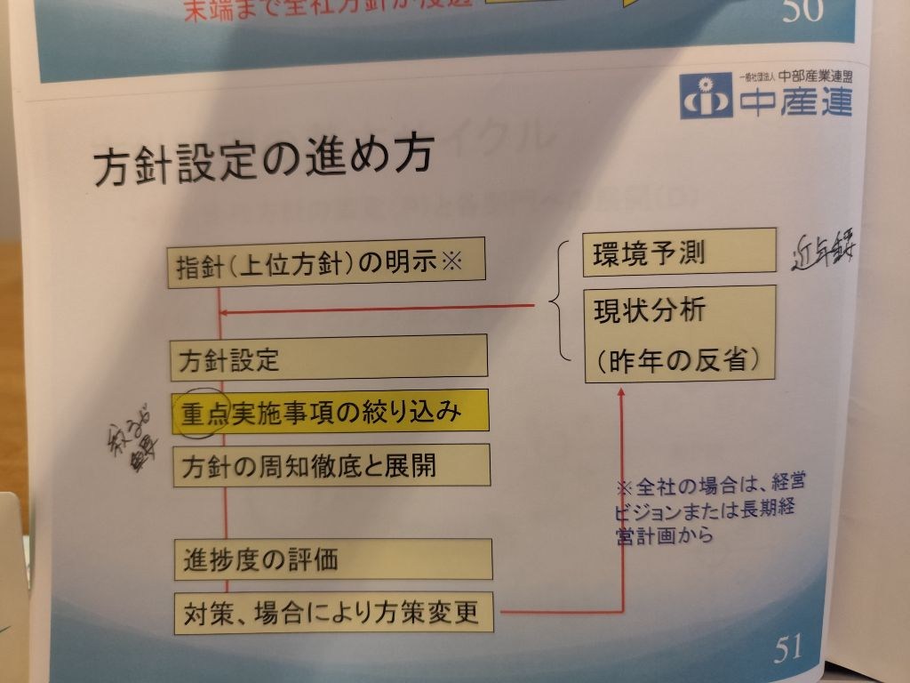

上位方針の明示、環境予測、現状分析、重点の絞り込み、展開、評価、修正という流れが整理されている。手書きメモの「過去の総括」「将来の手がかり」「中期ビジョン」は、このスライドの前段を補強しており、方針設定は思いつきではなく、過去と未来の両方を材料にして重点を選ぶ行為だと理解できる。課長に求められるのは、項目を並べることではなく、何を絞り、何を捨てるかを決めることである。

### 18. まとめる際にはストーリー化を

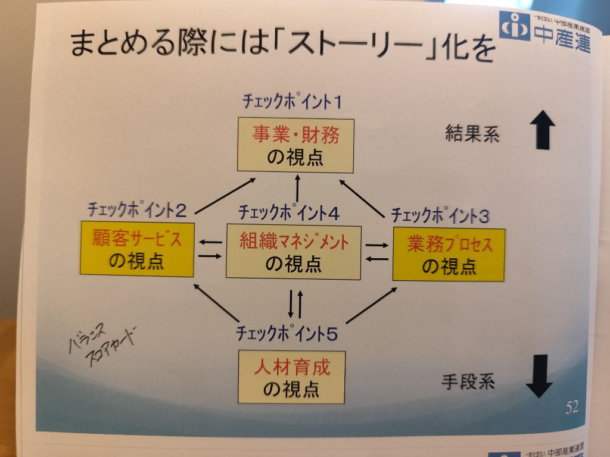

事業・財務、顧客、業務、組織、人材育成をばらばらに語るのでなく、因果関係をもってつなぐ必要を示すスライドである。文字起こしやメモで残っていた「言語化」「まとめる」「伝える」の課題は、このスライドがそのまま答えになっている。報告や方針説明では、単発施策を列挙するのではなく、「なぜこの順序でこの施策が必要か」を語れることが管理職の説得力につながる。

### 19. 点検はプロセスまで

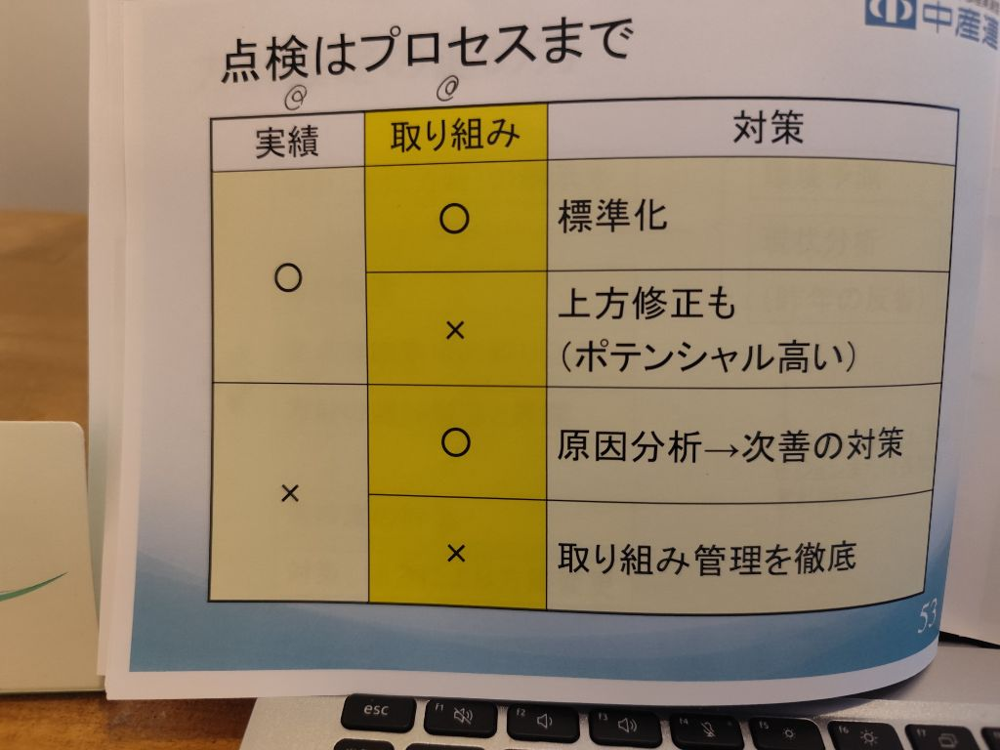

結果の良し悪しだけでなく、取り組みの中身まで見て標準化・修正・次善策を考えるべきことを示すスライドである。数字だけ見れば一見同じでも、取り組みができているのか、できていないのかで打つ手は変わる。管理者としては「結果が悪い」で終わらず、どこまで進んだのか、何がボトルネックかを見立てるレビュー力が必要だと感じた。

### 20. 方針管理が伝統的に得意とされること

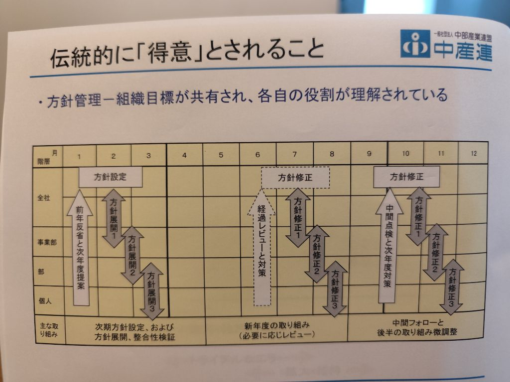

方針管理が、全社から個人まで時系列で展開・修正される運用であることを年間カレンダーで示したスライドである。これにより、方針管理は年初の宣言ではなく、途中レビューと修正を含んだ連続運転であることが理解しやすい。課長としては、いつ・何を・どの粒度で見直すのかをあらかじめ設計しておくことが、管理の実効性につながる。

### 21. PPM（ポートフォリオマネジメント）

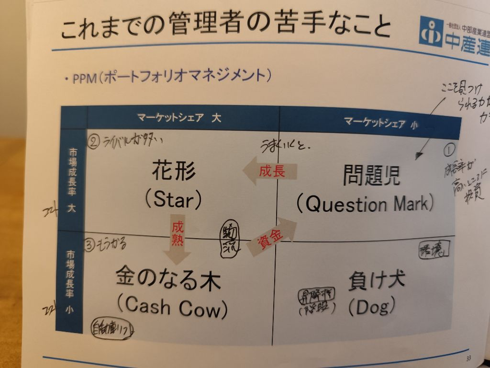

市場成長率とシェアで事業やテーマを位置づけ、投資・維持・撤退の判断を考える基本スライドである。文字起こしでは、「金のなる木が問題児を育てる」という資源還流のストーリーが強調されており、単なる4象限分類ではなく、資源配分の物語として理解することが大切だと分かる。自部署のテーマをこのレンズで見直すと、惰性で続けているものと、育てるべきものを切り分けやすくなる。

### 22. リバース・イノベーション

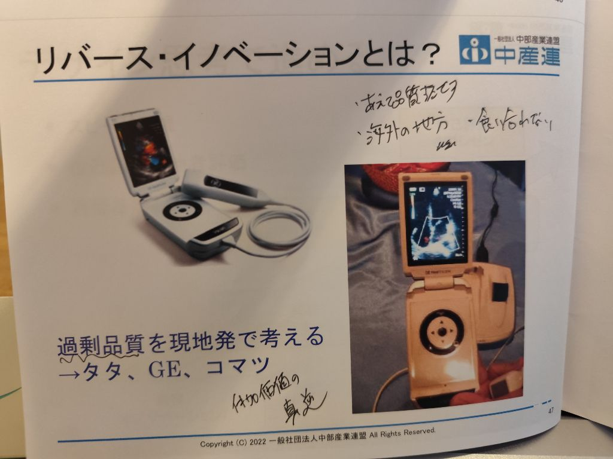

高機能・高品質を当然とせず、現地の制約や過剰品質の見直しから新しい価値をつくる発想を示すスライドである。ブルーオーシャンの補助線として見ると、「足す」だけではなく「削る」「外す」ことが革新につながるという理解が深まる。製品企画だけでなく、設計標準や業務フローにも応用できる考え方として持ち帰りたい。

## 4. アンケート結果から見えた現場課題

### 23. 受講者属性 / 現状の管理業務比率

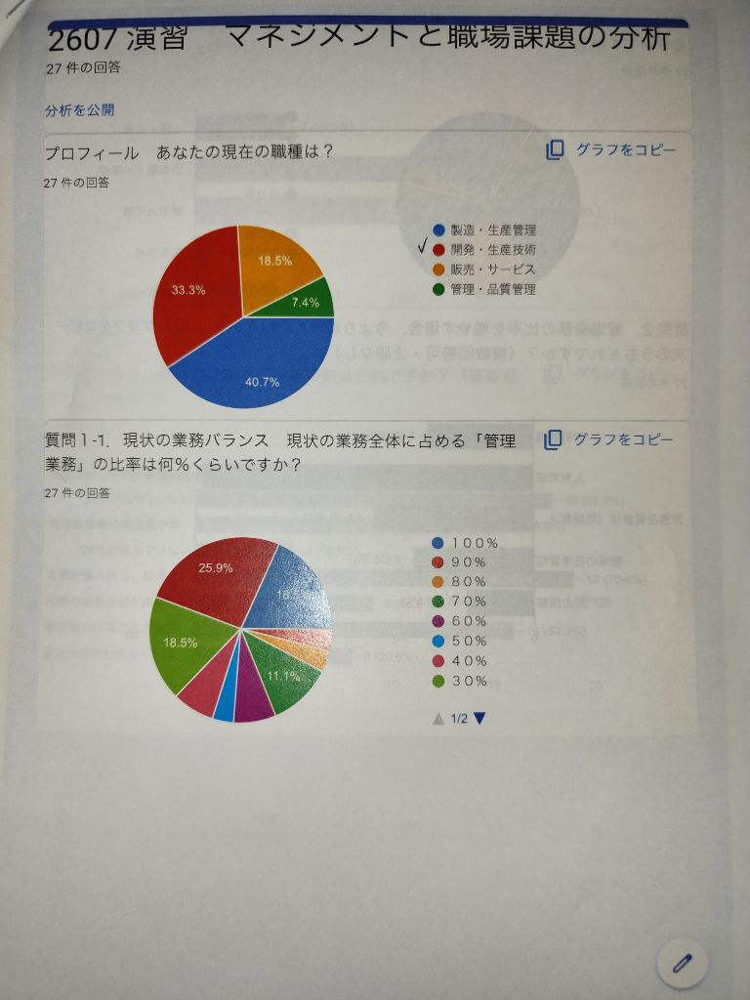

受講者の中心が製造・生産管理、開発・生産技術であり、現場に近い課長層が多かったことが分かる。現状の管理業務比率は高いとは言い難く、実務に引っ張られている構造が共通課題として表れている。これは自分固有の悩みではなく、現場型課長に共通する構造問題であり、だからこそ仕組みで実務を減らす必要があると再確認できた。

### 24. 理想の管理業務比率 / 増やしたい管理業務

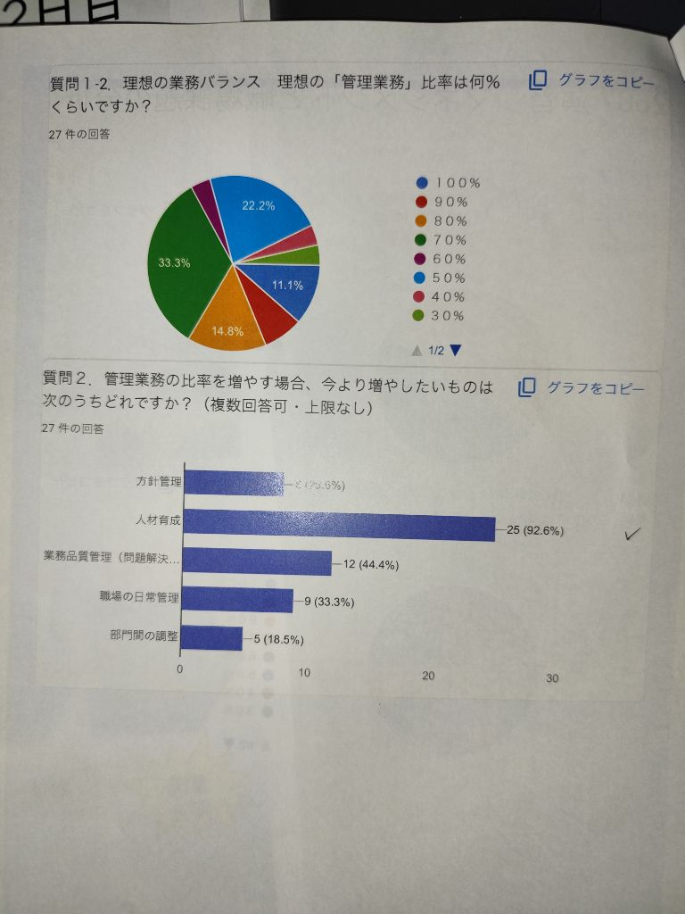

理想の管理業務比率は70〜80％帯が中心であり、多くの受講者が管理業務へもっと時間を振りたいと考えていることが分かる。特に「人材育成」が突出している点は、管理職自身が本来の役割を理解している証拠でもある。つまり課題は意識不足ではなく、管理に振り向ける時間と構造が不足していることだと読み取れる。

### 25. 実務をどう減らすか / 部門の業務課題

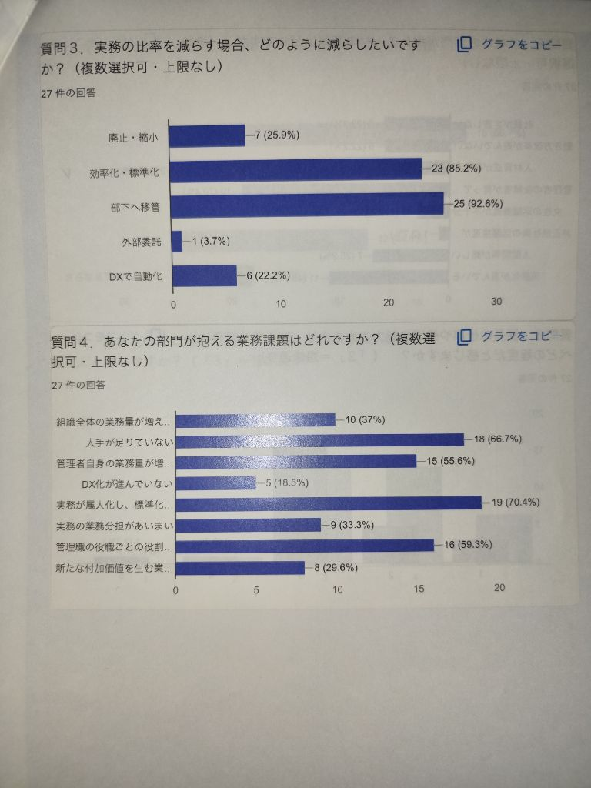

実務を減らす方法として「部下へ移管」「効率化・標準化」が上位であり、部門課題として「属人化」「役割不明確」が大きいことが示されている。これは、任せる意志はあるが、任せられる状態が整っていないことを意味する。研修全体を通して見ても、管理と実務の比率を逆転させるには、個人の気合ではなく、標準化・移管・役割明確化の設計が先に必要だと感じた。

### 26. 人材課題 / 課長職の魅力

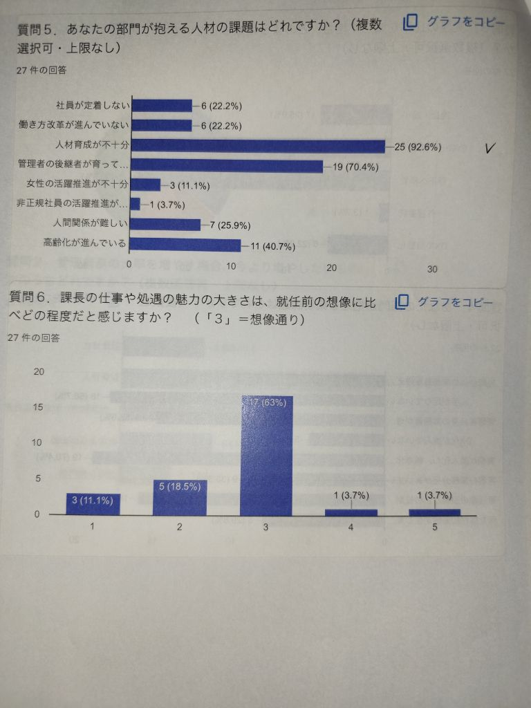

人材育成不足と後継者未育成が大きな課題であることが、数値として鮮明に出ている。一方で課長職そのものの魅力は「想像通り」と答える人が多く、役割自体が否定されているわけではない。つまり、課長という役割には意味があるが、それをやり切る余力と仕組みが足りていないことが問題の本質だと受け止めた。

### 27. 魅力の判断要素 / 負担感の大きさ

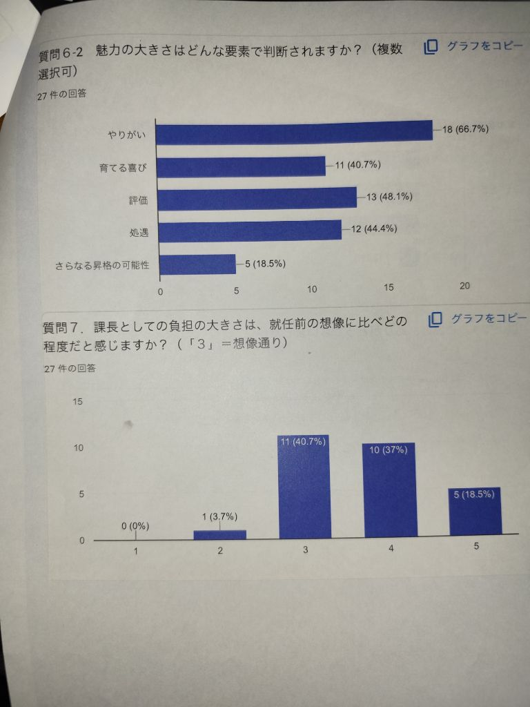

課長職の魅力は「やりがい」「評価」「育てる喜び」など、仕事の中身そのものに紐づいている。一方で負担感も軽くはなく、やりがいと重さが同居する役職であることが分かる。だからこそ、課長の魅力を維持するには、本人の頑張りに依存せず、任せ方・支え方・見直し方を組織として整える必要がある。

### 28. 負担の大きさを判断する要素

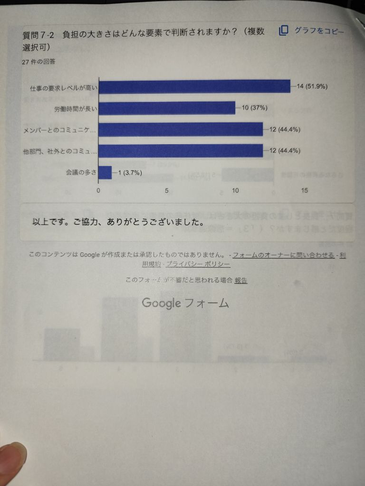

負担感の中心は、仕事の要求レベルの高さに加えて、メンバーや他部門・社外とのコミュニケーション量にあることが示されている。課長の仕事は単なる中継ではなく、多方向の調整役であることが数字からも裏づけられる。今後は、調整を全部自分で抱え込むのでなく、役割分担、標準化、会議設計まで含めて見直す必要があると感じた。

## 今回の学びを自部署へどう持ち帰るか

### 1. 管理と実務の比率を意図的に逆転させる
アンケート結果と講義内容の双方から見えてきたのは、管理職が本来担うべき人材育成・調整・レビュー・方針展開の時間が、実務に食われているという現実である。したがって、まず必要なのは気合ではなく、標準化・移管・役割明確化によって管理時間を先に確保する設計である。

### 2. フレームを「知っている」から「説明できる」へ上げる
SWOT、KFS、ポーター、RBV、アンゾフ、PPMは、埋めることが目的ではなく、現場課題を説明し、選択肢を比較し、意思決定を伝えるための道具である。今後は、フレームの名称を知っている状態から、自部署のテーマに引きつけて本質を語れる状態へ引き上げたい。

### 3. 方針を翻訳する立場としての課長を自覚する
方針管理のスライド群から強く感じたのは、全社方針を個人目標へ落とし込む翻訳者が各階層に必要だということだった。課長は、上から来た言葉をそのまま流すのではなく、部門の現実に合わせて解釈し、メンバーの行動へ接続する役割を持つ。

### 4. 言語化・要約・伝達を自分の重点課題にする
研修全体を通して、自分の課題として最も強く意識されたのは、分かっていることを伝わる形にする力である。ストーリー化、レビュー、方針展開、問題解決指導のすべてにおいて、最後は言葉で人を動かす必要があるため、今後はこの力を重点的に高めたい。

### 5. 社内に壁打ちの場を持ち込む
異業種の受講者との対話により、自社では当たり前になっている論点が外から照らされ、思考の精度が上がる感覚があった。今後は社内でも、開発・製造・営業・品質など立場の違う人同士がテーマを持ち寄り、方針や施策を壁打ちできる場をつくりたい。

## GitHubへの配置前提

- 本ファイル名：`Lecture.md`
- 画像格納先：`images/` フォルダ
- 本文中の画像参照はすべて `./images/...` の相対パスで統一
- そのまま `Reports/202607-ChusanrenKachoKenshu/` 配下へ配置して push すれば表示可能
