# イプロスAI 2026 夏（AI/DX経営課題の解決展・第2回 AI/DX営業・マーケティング展）視察

> 作成日：2026-07-29　最終更新日：2026-07-29

## 📜 改訂履歴

| 日付 | 追記者 | 内容（クリックでジャンプ） |
|---|---|---|
| 2026-07-29 | ryo-m | 初版作成 |

---

## 出張概要

| 項目 | 内容 |
|---|---|
| 展示会名 | イプロスAI 2026 夏（初開催「AI/DX経営課題の解決展」／第2回「AI/DX営業・マーケティング展」同時開催） |
| テーマ | 明日から使えるAIが見つかる展示会 |
| 会期 | 2026年7月29日（水）〜7月31日（金）10:00〜17:00（視察はDAY1・7月29日） |
| 会場 | 有明GYM-EX（東京ビッグサイトが運営、旧・有明競技場を展示場にリニューアル） |
| 主催 | 株式会社イプロス |
| 出張者 | 前川 |
| 作成 | ryo-m（原資料：前川の日報） |

出典：<a href="https://ex.ipros.jp/expo/iprosai/">イプロスAI 2026 夏 公式サイト</a>、<a href="https://prtimes.jp/main/html/rd/p/000000133.000001332.html">株式会社イプロス プレスリリース</a>（いずれも2026年掲載・2026-07-29取得）

---

## 1. サマリー

イプロスAI 2026 夏（AI/DX経営課題の解決展・AI/DX営業マーケティング展）を有明GYM-EXで視察した。会場はDX提案ブースが非常に多く、各社の提案内容が似通っていること、来場者への声掛けが客引きさながらに積極的であることから、AI/DX市場の競争の激しさを肌で感じる視察になった。

- DX提案（営業・マーケティング系AIツール）のブースが乱立し、差別化に苦労している様子がうかがえた
- 一方でフィジカルAI/ロボットゾーンは実機・実演中心で、現場で使えるかどうかが一目でわかる展示が並んでいた
- **inbyte**：ユーザー現場のデータを継続学習させ、西日・逆光にも対応する安全カメラの改良プロセスが印象的だった
- **FA ROBOT MANAGEMENT（XIAOYUBOT）**：ハンディ端末で溶接箇所をなぞるだけでAIが経路を自動生成する自律溶接ロボットを確認した
- **横山商会（Motion Catch）**：カメラを使わずミリ波レーダーで呼吸・心拍・転倒まで検知する一人作業見守りシステムを見た
- 今後の商品開発では、LiDAR・AIカメラ・ミリ波レーダーを目的に応じて組み合わせる視点を持ちたいと感じた

---

## 2. 展示会概要・参加者

 
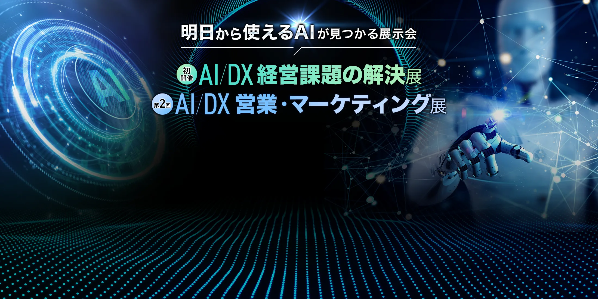

「イプロスAI 2026 夏」公式キービジュアル。初開催の「AI/DX経営課題の解決展」と第2回「AI/DX営業・マーケティング展」の同時開催（出典：<a href="https://ex.ipros.jp/expo/iprosai/">イプロスAI 2026 夏公式サイト</a>、2026年掲載・2026-07-29取得）。

イプロスAI 2026 夏は、株式会社イプロスが主催する「明日から使えるAIが見つかる展示会」。初開催となる「AI/DX経営課題の解決展」と、第2回を数える「AI/DX営業・マーケティング展」の2展が同時開催される構成で、2026年7月29日（水）から31日（金）までの3日間、有明GYM-EXで行われる。視察は初日（DAY1）の7月29日で、出張者は前川。

 
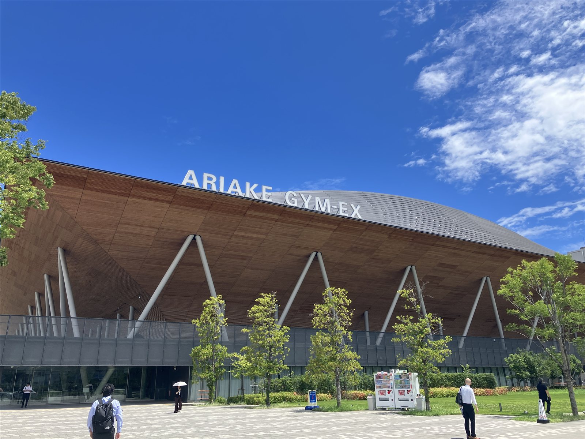

会場の有明GYM-EXは、東京2020オリンピックの会場だった有明競技場を、東京ビッグサイトが展示場としてリニューアルした施設である。

---

## 3. 視察の目的

- AI/DX経営課題解決・営業マーケティング領域における提案の傾向と、市場の競争環境を把握すること
- フィジカルAI（AIカメラ・自律溶接ロボット・ミリ波レーダー等）の実装レベルを、実機・実演を通じて確認すること
- 自社の新商品開発につながる要素技術（センシング・自動化）のヒントを持ち帰ること

---

## 4. 背景（環境変化）

イプロスAI 2026 夏は、これまで営業・マーケティング領域を対象にしてきた「AI/DX営業・マーケティング展」（今回で第2回）に加え、経営課題全般を対象とする「AI/DX経営課題の解決展」が今回初めて開催されるかたちで実現した。AI/DX活用の裾野が、営業・マーケティングという特定業務から経営課題全般へ広がっていることの表れと見てよい。

 

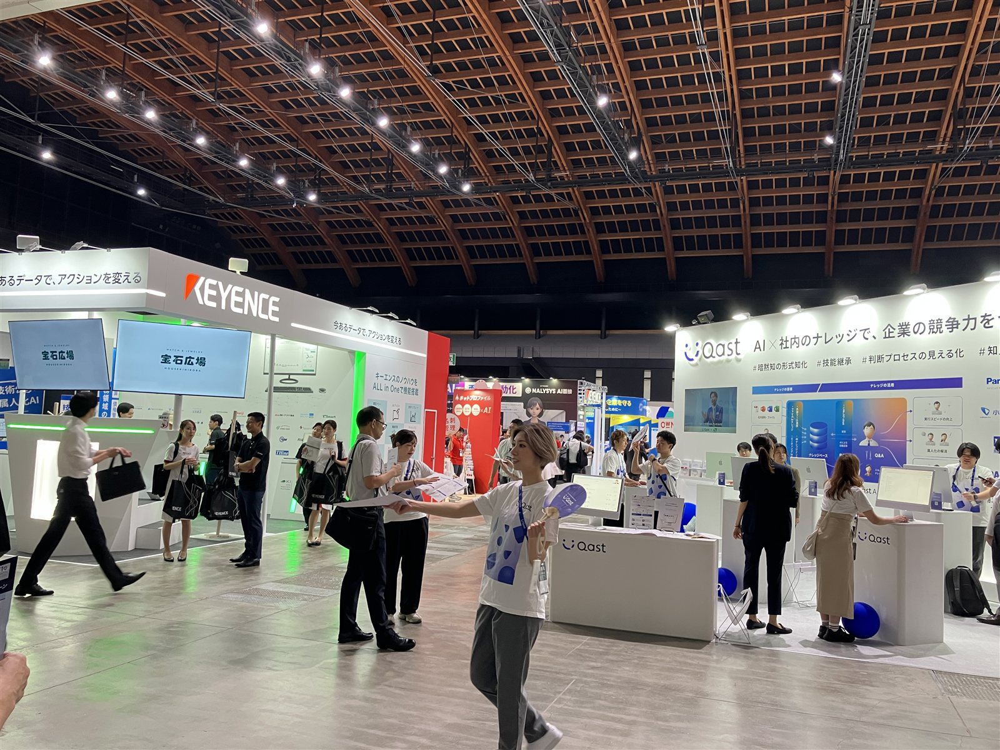
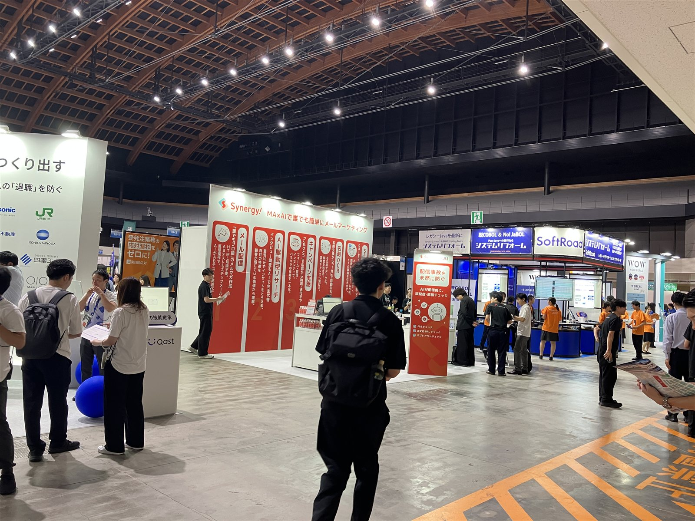

（左）KEYENCE・Qastなど大手を含むDX提案ブースが並ぶ通路。（右）Synergy（メールマーケティング）やシステムリフォーム関連の提案ブースが続く一帯。

前川の日報にあるとおり、DX提案ブースは「非常に多く、各社とも類似した提案が目立」ち、「来場者への声掛けも積極的で客引きのように一緒についてくることも多かった」という。この様子から、AI/DXの営業・マーケティング支援は既に提案内容のコモディティ化が進み、差別化の難しいレッドオーシャンに近づいていることがうかがえる。

 
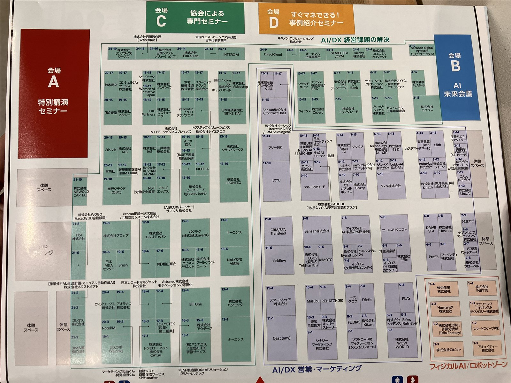

会場フロアマップ。会場A・Bが特別講演セミナー・AI未来会議、会場C・Dが専門セミナー・事例紹介セミナーで、右下（オレンジ枠）が「フィジカルAI/ロボットゾーン」。

一方、フロアマップのとおり「フィジカルAI/ロボットゾーン」は独立した一角として設けられており、伸栄産業・HumansX・Ollo・ロビット・INBYTE・パナソニックアドバンストテクノロジー・スマートスケープ・アキュイティーといった、現実世界のハードウェアにAIを組み込む企業が集まっていた。ソフトウェア提案が乱立するフロアの中で、実機・実演で勝負するこのゾーンは異質な存在感を放っていた。

---

## 5. 内容（時系列）

### 5.1 会場到着・展示会全体の様子

 
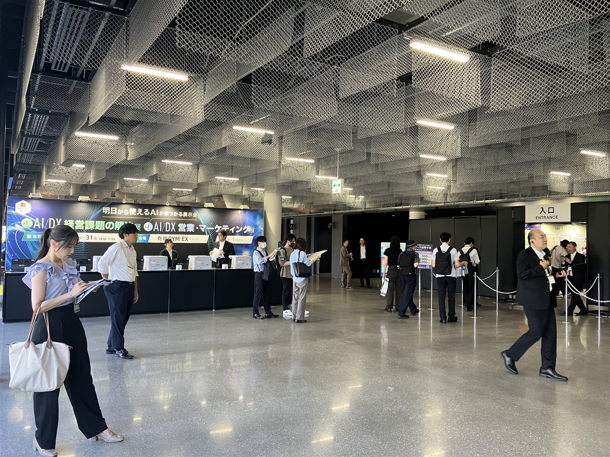

受付・入口付近。開場直後で来場者の列ができており、スタッフからパンフレットを受け取る来場者の姿も見える。

DX提案ブースが並ぶエリアを一通り回り、各社の提案内容の似通いぶりと、客引きさながらの積極的な声掛けを体感した後、フィジカルAI/ロボットゾーンへ向かった。

### 5.2 フィジカルAI/ロボットゾーン

 
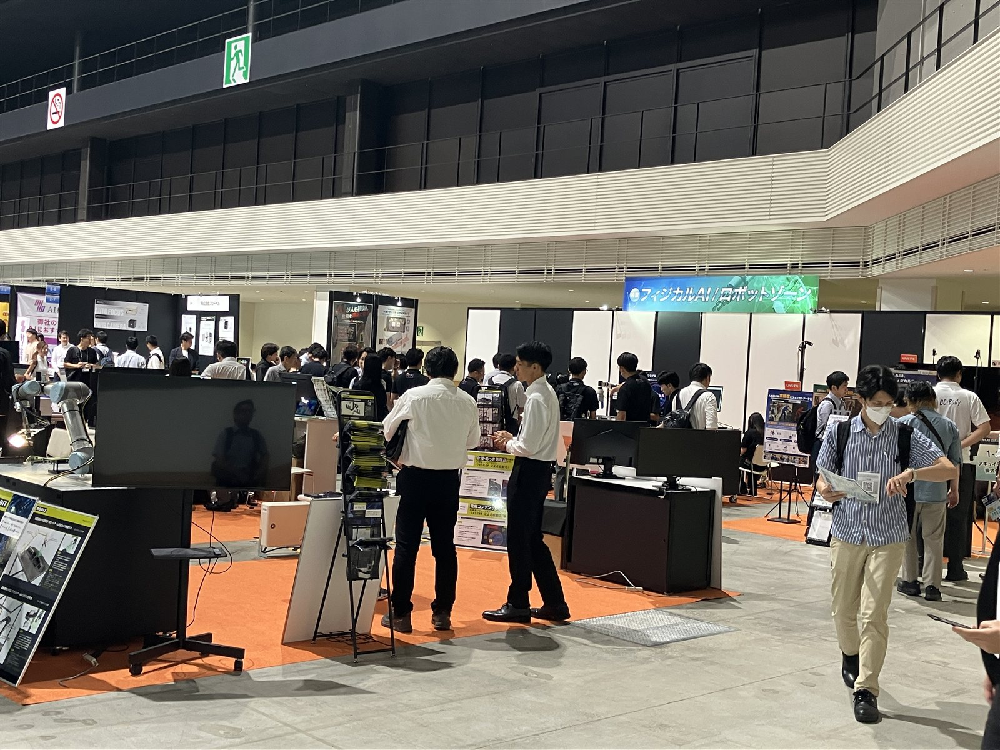

フィジカルAI/ロボットゾーンの入口付近。モニターやロボットアームの実機が並び、他のDXブースとは違う実演中心の空気が漂う。

 
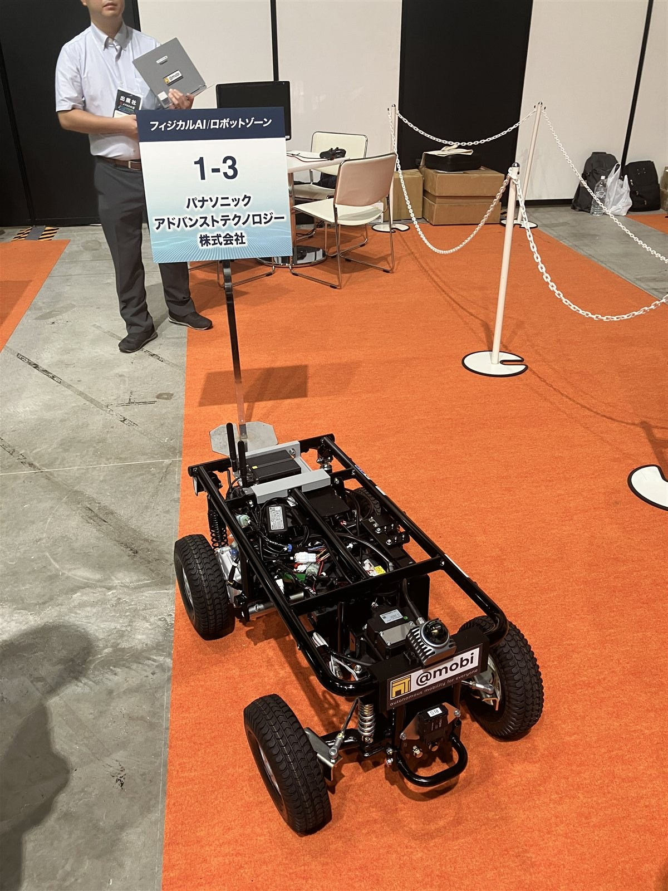

隣接する1-3ブース、パナソニックアドバンストテクノロジー株式会社。「@mobi」ブランドの自律移動プラットフォーム用シャーシを展示していた（詳細説明は日報に記載なし）。

前川がフィジカルAIブースの中から特に回ったのは、次の3社である。

#### ① inbyte（AI安全カメラ）

 
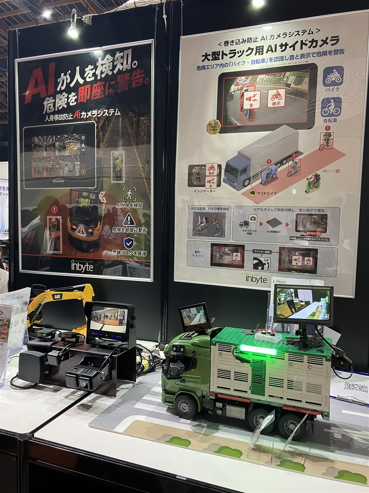

「巻き込み防止AIカメラシステム」の展示パネル。人身事故防止AIカメラシステムと、大型トラック用AIサイドカメラ（バイク・自転車を認識し音と表示で警告）の2枚。

 
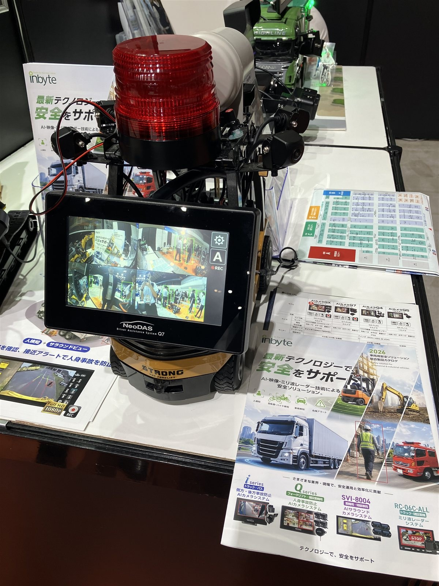

ドライバー支援システム「NeoDAS Q7」の実機。4分割のサラウンドビューモニターに、フォークリフト・重機の縮小模型を使ったデモ映像が映る。

AIを活用した安全カメラシステムの展示で、人や自転車・バイクなどを認識し、危険時には音や表示で警告する仕組みだった。前川が印象的だったと記すのは、単に売り切りの製品ではない点である。

> 「実際のユーザー環境から収集したデータを継続的にAIへ学習させることで、西日や逆光など現場特有の環境変化にも対応し、検知精度を向上させている点です。製品を販売して終わりではなく、現場の声を反映しながら進化させる考え方が参考になりました」（前川）

株式会社INBYTEは2005年設立、東京都港区に本社を置き、大型車両向けの後付けAIカメラシステムを開発・販売している（出典：[株式会社INBYTE公式サイト](https://www.inbyte.jp/company.php)、2026-07-29取得）。

#### ② FA ROBOT MANAGEMENT（XIAOYUBOT）

 
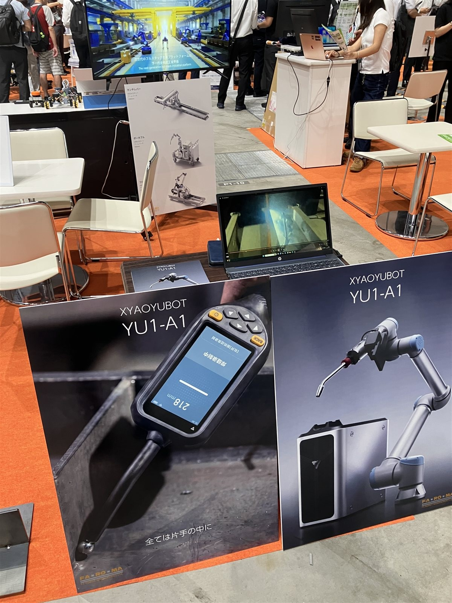

自律型溶接ロボット「XIAOYUBOT YU1-A1」の展示。モニターには「次世代のフルスタック工業プラットフォーム」の紹介映像、手元では専用ハンディ端末（3D位置決めペン）に「218mm」の数値が表示されている。

 
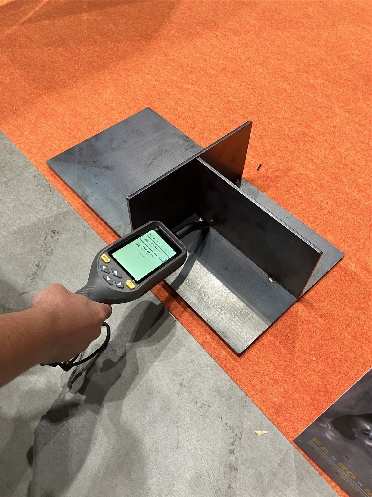

実演のクローズアップ。鉄板の溶接箇所にハンディ端末を沿わせ、開始点・終了点を「なぞる」だけで教示する様子。

従来の産業用ロボットのようなティーチング主体ではなく、3D認識とAIによってその場で溶接経路を自動生成することが最大の特徴だという。

> 「ロボット化が難しかった一品物や大型構造物でも、人がハンディ端末で溶接箇所をなぞるだけでAIが経路を生成し、自動溶接できる点にAI活用の活かし方を感じました」（前川）

 

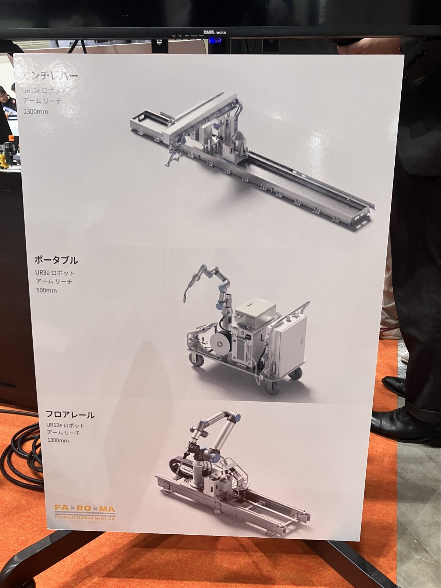
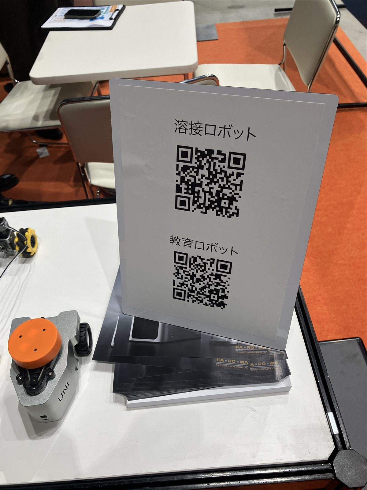

（左）設置バリエーションの紹介パネル。インチレバー・ポータブル・フロアレールの3タイプ、いずれもUR12e／UR3eの協働ロボットアームをベースにする。（右）「溶接ロボット」「教育ロボット」それぞれのQRコード案内パネルと、手前に小型アーム「UNI」。

 
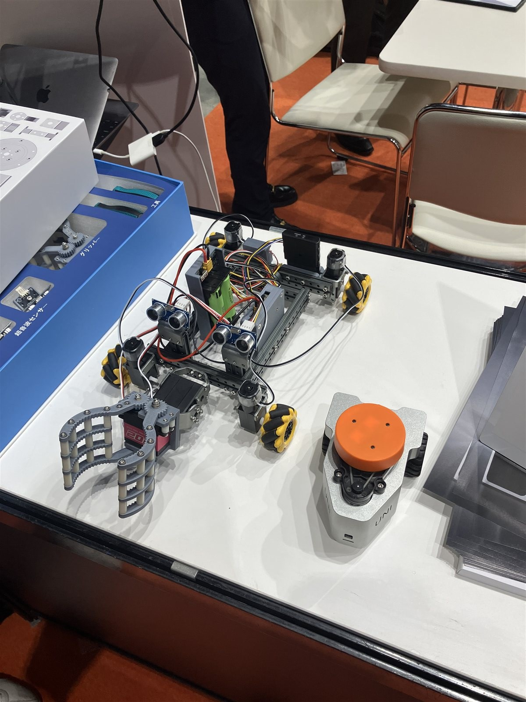

教育ロボット向けと見られる小型アーム試作機。超音波センサーやグリッパーのキットが並び、UNI型の小型ユニットも一緒に展示されている。

この商品はXiaomiの技術者が独立して開発したもので、中国では既に実績があり、日本では9月から販売開始予定とのこと。価格は1000万円を切るという話だったと日報にある（ブーススタッフからの説明として前川が記録したもので、独立したソースでの裏付けは取れていない。ブース掲示のブランド名は「FA×RO×MA／FA ROBOT MANAGEMENT Ltd.」）。ロボット化しづらかった一品物・大型構造物の溶接という、まさに「非定型・多品種」の壁に、ティーチングレスで挑む商品設計は、量産前提の従来型ロボットとは狙いが異なる。

#### ③ 横山商会（Motion Catch）

 

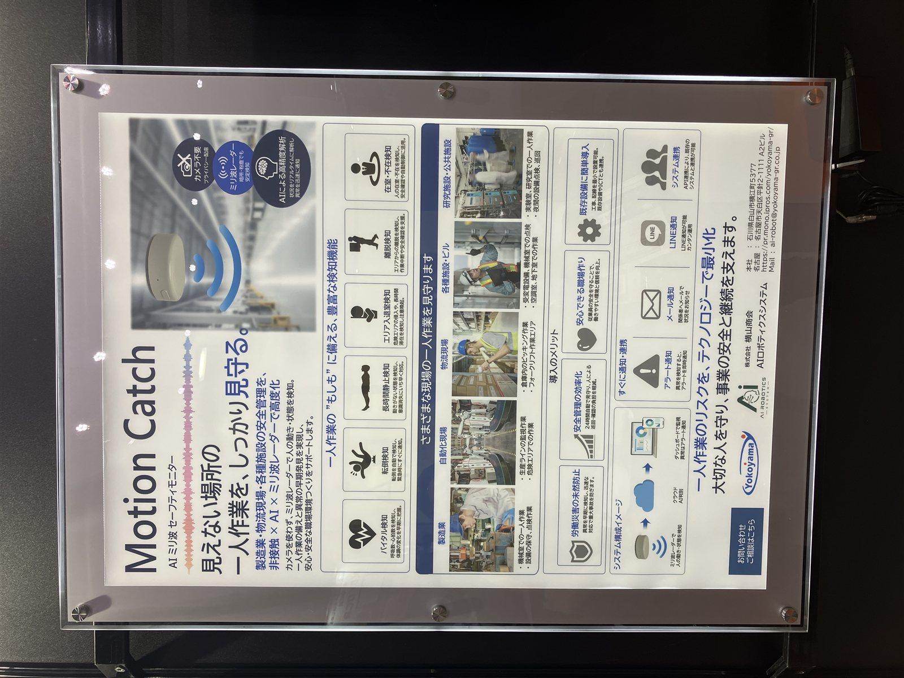
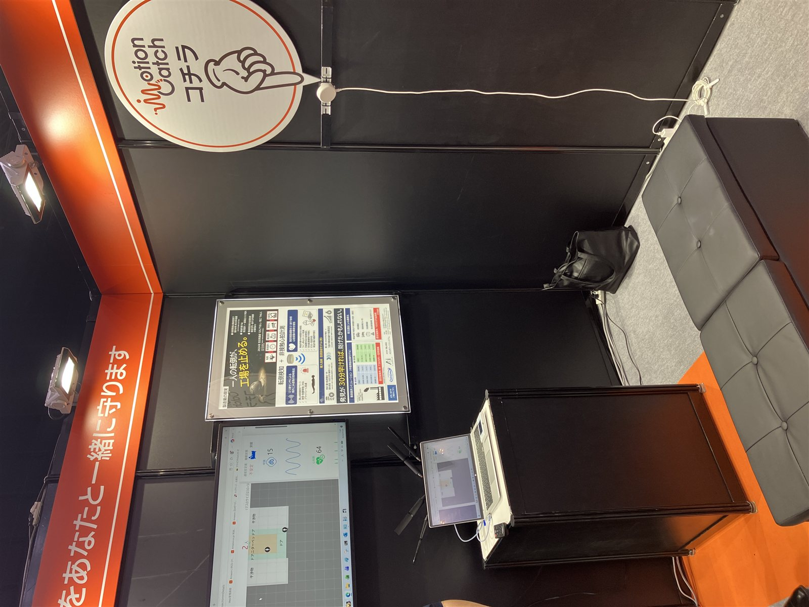

（左）「Motion Catch」の製品紹介パネル。カメラ不要・ミリ波レーダー・AI高精度解析の3点を訴求する。（右）横山商会のブース全景。「Motion Catchコチラ」の案内看板と、モニターに実演画面を表示するデモ卓。

 
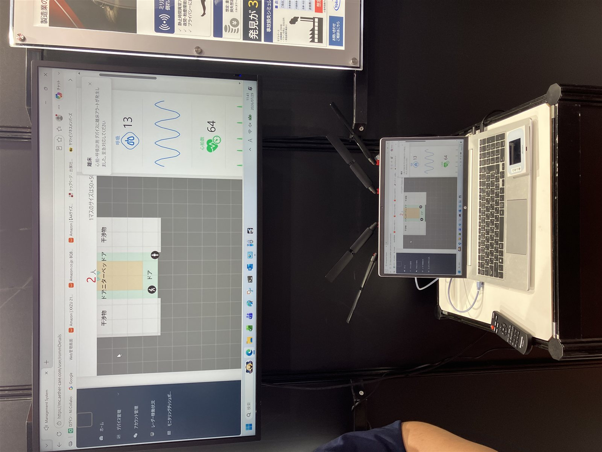

実演画面のクローズアップ。マップ上に「2人」を検知した表示、呼吸数13・心拍数64のリアルタイム波形、「離床アラートが発生しました」の通知。画面右下の時計は2026/07/29 11:41を示す。

ミリ波レーダーを活用した一人作業見守りシステム「Motion Catch」。カメラを使用せず、人の位置だけでなく呼吸・心拍・転倒・長時間静止まで検知できることが特徴だという。

> 「作業エリアで一人作業の安全管理の用途ですが、整備リフトでの人の検知などでも活用できると感じました。AIカメラとは異なるアプローチができそうな感触です」（前川）

株式会社横山商会は石川県白山市に本社を置き、「AIロボティクスシステム」事業としてMotion Catchを展開している（出典：ブース掲示、2026-07-29取得）。カメラで撮れない・撮ってはいけない場所の見守りという、AIカメラ陣営とは正反対のアプローチであり、前川が感じたとおり整備リフトなど自社の現場にも転用できる余地がありそうだ。

---

## 6. まとめ

### 視察全体を通じた気づき・所感

DX提案ブースの乱立ぶりから、AI/DX活用の話題性はもはや「話すだけ」では差別化にならない段階に来ていると感じた。一方でフィジカルAIゾーンの3社は、いずれも「センサーで現場の状態を捉え、AIで判断し、人や機械の行動に反映する」という共通の骨格を持ちながら、アプローチはカメラ（inbyte）・3D視覚＋ハンディ教示（XIAOYUBOT）・ミリ波レーダー（Motion Catch）と三者三様だった。

> 「今後の商品開発でも、LiDAR・AIカメラ・ミリ波レーダーなどを目的に応じて組み合わせ、安全性や付加価値を高めた製品づくりにつなげていきたいと感じました」（前川）

特にXIAOYUBOTの「ハンディ端末でなぞるだけ」という教示方式は、ロボット導入の障壁になりがちな専門オペレータ依存を崩す発想であり、Motion Catchの「カメラを置けない場所の見守り」は、既存のAIカメラ提案と競合しない棲み分けとして参考になる。

## その他の写真

本編の流れには収めなかった写真を収録する。

 
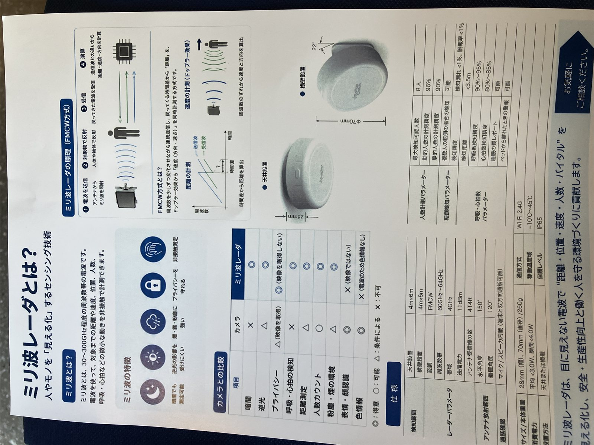